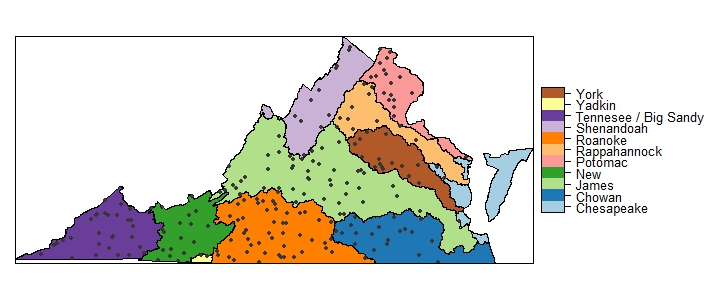
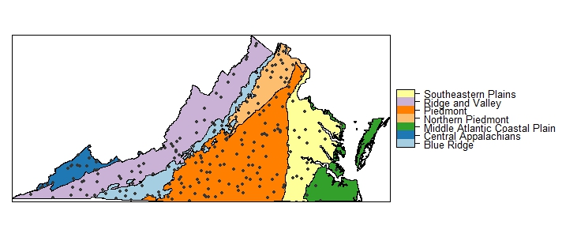

```{r startup, include=FALSE, echo=FALSE}
#Run in R3.6.0


knitr::opts_chunk$set(echo = FALSE)

suppressPackageStartupMessages(library(tidyverse))#1.2.1
suppressPackageStartupMessages(library(sf))#0.7-6
suppressPackageStartupMessages(library(sp))
suppressPackageStartupMessages(library(rgdal))
suppressPackageStartupMessages(library(micromap))
suppressPackageStartupMessages(library(RColorBrewer))
suppressPackageStartupMessages(library(lattice))
suppressPackageStartupMessages(library(docxtools))

suppressPackageStartupMessages(library(extrafont))
#font_import()  # run once to import fonts for ggplot2 font family calls. This may take a while, only do once 
#extrafont::loadfonts(device="win") # run this once each session, see https://cran.r-project.org/web/packages/extrafont/README.html for more info on the font_import() function required for "	font family not found in Windows font database" warning to go away


# Data needed for maps (needs to be in report for figure generation vs in global file)
basinssmooth <- rgdal::readOGR('originalData','VAbasins_smoothNoChesPeeDee')# basin shapefile for micromaps
VAoutline <- rgdal::readOGR('originalData','Va_otlne') # for basic site maps
VAbasins <- rgdal::readOGR('originalData','basinsstatewide') # for basic site maps
VAecoregionsL3 <- rgdal::readOGR('originalData', 'VA_level3ecoregion') # for basic site maps
allProb <- rgdal::readOGR('processedData','allProb2018')# for basic site maps
IRstations2018 <- rgdal::readOGR("processedData","IRstations2018") # for basic site maps
# Bring in shapefile already made of previous IR sites by window
IRstations <- rgdal::readOGR('originalData','MasterIRStationList')
# a little data management action
IRstations2008 <- subset(IRstations, IRstations@data$IR2008 == '2008')
IRstations2010 <- subset(IRstations, IRstations@data$IR2010 == '2010')
IRstations2012 <- subset(IRstations, IRstations@data$IR2012 == '2012')
IRstations2014 <- subset(IRstations, IRstations@data$IR2014 == '2014')
IRstations2016 <- subset(IRstations, IRstations@data$IR2016 == '2016')
boatableSites <- rgdal::readOGR("processedData","boatableSites2006_2016")
boatableWshd <- rgdal::readOGR("processedData","boatableWshd2006_2016")
allProb_wshd <- rgdal::readOGR("processedData","allProbWshd2018")


#source('global.R')
source('global_updatedMoE.R')

```


```{r pagebreak, fig.height = 6.5}
# force page break
put_gap()
```

## Chapter 2.4 FRESHWATER PROBABILISTIC MONITORING

### 2.4.1 Executive Summary

&nbsp;&nbsp;&nbsp;&nbsp;&nbsp;&nbsp;Probabilistic Monitoring (ProbMon) employs random site selection to produce statistically unbiased estimates of water quality conditions proportional to their occurrence across the Commonwealth. The agency's other water monitoring programs are focused on specific environmental questions at selected study sites, for example evaluating the effects of identified pollution sources or mitigation efforts. These programs are inappropriate for estimating water quality on a statewide basis. ProbMon is the most appropriate program for addressing important water quality questions such as evaluating large-scale watershed management activities and developing statewide assessment methodologies. ProbMon is a cost-effective way to evaluate Virginia waters, test new methods, and to support other agency activities such as water quality standards development, Total Maximum Daily Load (TMDL) studies, and determining permit limits. The survey design, analysis, geovisualization, and reporting of ProbMon data uses open source software, which promotes the scientific transparency and reproducibility of this monitoring program[^1]. 

&nbsp;&nbsp;&nbsp;&nbsp;&nbsp;&nbsp;Since 2001, the DEQ ProbMon program has sampled `r nrow(surveyData)` randomly selected wadeable sites (Figure 2.4-5) to provide statistically valid estimates of statewide biological condition and stressor extent.  The robust dataset can provide insight into water quality status at US Level III ecoregion and river basin-specific scales, a first for the Commonwealth.  Over `r signif(nrow(filter(designStatus,IR2018 == '2018')),digits=2)` sites were sampled during the 2018 assessment period (Figure 2.4-2). The majority of Virginia streams meet applicable numeric water quality criteria associated with aquatic life use. However, nearly half of Virginia streams fail to meet biological condition expectations based on aquatic organism communities as indicators of stream health. Water quality problems associated with parameters for which criteria exist are minimal, compared to those for which numeric criteria have not been developed (Figure 2.4-1). Therefore, many biological impairments are suspected to be caused in part by stressors such as streambed sedimentation, habitat disturbance, and nutrients, for which no numeric criteria exist. 

##### Figure 2.4-1.  Percentage of stream miles with water quality parameters exceeding criteria. Orange bars indicate parameters with no water quality standards and green bars indicate parameters with water quality standards. Horizontal lines associated with each parameter illustrates 95% confidence limits. Figure represents data collected from `r IRrange`. 

```{r fig2.4-1, fig.width=8, fig.height=2.9}
p2.4.1 <- suppressWarnings(
  ggplot(paramsummary,aes(Parameter,pct,fill=Standard,label=pct))+
    geom_bar(stat='identity')+
    theme(aspect.ratio=4/6)+
    labs(x="Parameter", y = "Percent of Stream Miles")+ylim(-1,60)+
    scale_x_discrete(breaks=paramsummary$Parameter,labels=paramsummary$Parameter)+
    coord_flip()+
    geom_text(aes(label=paste(format(pct,digits=1,nsmall=1),"% +/- ",
                              format(MoE,digits=1,nsmall=1),"%",sep=""),
                  y=58.75),size=3,family="Arial")+
    geom_errorbar(aes(ymin=pct-MoE, ymax=pct+MoE), width=0.2)+ # error bars
    theme_minimal()+scale_fill_manual(values=c("#D55E00","#009E73"))+
    theme(legend.position="none")+ # no legend, center title
    theme(text=element_text(family="Arial"),
    panel.grid.major.x = element_blank(),panel.grid.minor = element_blank(),panel.background = element_blank(),
    axis.line = element_line(colour = "black"))+ # no background grid
    theme(plot.margin=unit(c(0,1,0,0),'cm')))
  
p2.4.1 
```

[^1]:All data and analysis scripts can be accessed at : https://www.deq.virginia.gov/Programs/Water/WaterQualityInformationTMDLs/WaterQualityMonitoring/ProbabilisticMonitoring/ProbMonDataSources.aspx .

&nbsp;&nbsp;&nbsp;&nbsp;&nbsp;&nbsp;ProbMon provides essential methodology for identifying water quality problems for which numeric criteria do not exist.  For example, the agency uses ProbMon data to conduct benthic stressor analyses when developing TMDLs to determine the most probable water quality problems causing benthic impairments (i.e. the most probable stressors). These analyses often identify nutrients or sedimentation as the most probable stressors. The agency is also working in conjunction with the Water Quality Academic Advisory Committee to develop a screening approach for nutrient criteria. This strategy employs ProbMon data to evaluate the potential for impairment based not only on nutrient concentrations, but also on indirect evidence such as abnormal pH, dissolved oxygen, and degraded benthic macroinvertebrate communities. The unbiased, statewide approach to collecting water quality data employed in ProbMon provides an invaluable tool for developing and improving assessment methods. For example, methods for conducting genus-level (rather than the current family-level) macroinvertebrate bioassessments as well as fish-based bioassessments are in development. Development of these new tools, which should greatly improve the accuracy and precision of aquatic life use assessments in the commonwealth, would not be possible without the extensive dataset produced from the Probmon program.  

&nbsp;&nbsp;&nbsp;&nbsp;&nbsp;&nbsp;The agency has employed numerous watershed-scale restoration and protection efforts aimed at water quality parameters for which standards are lacking.  For example, the Commonwealth has a long-standing commitment to achieve its share of the nutrient and sediment reductions needed to comply with the Chesapeake Bay TMDL (Bay TMDL).  Virginia’s Chesapeake Bay Watershed Implementation Plan (submitted to EPA in August 2019) documents a mix of regulatory and non-regulatory programs aimed at reducing nutrients across all sources to comply with the bay TMDL.  ProbMon is the most appropriate way to directly evaluate the effectiveness of these large-scale management strategies for improving aquatic life use conditions.      


### 2.4.2 Introduction	

&nbsp;&nbsp;&nbsp;&nbsp;&nbsp;&nbsp;Probabilistic monitoring is designed to answer basic questions like: “What are the primary water quality problems in Virginia? How widespread are these problems, and what pollutants cause the greatest environmental stress to Virginia’s water resources?” The Virginia General Assembly, citizens, environmental stakeholders, and the United States Environmental Protection Agency (EPA) have encouraged the Virginia Department of Environmental Quality (DEQ) to answer these questions and to establish baseline water quality conditions for Virginia’s streams and rivers. ProbMon is the component of DEQ’s Water Quality Monitoring Strategy that can estimate water quality conditions statewide due to the statistically designed sampling network. This network is developed based on random site selection at a spatial density that allows for estimation of water quality conditions statewide on an annual basis.

&nbsp;&nbsp;&nbsp;&nbsp;&nbsp;&nbsp;Extrapolating estimates of water quality conditions across large spatial areas requires the ProbMon sample design to differ from all other DEQ monitoring strategies. Typically, water quality monitoring stations are located at bridges, boat ramps or other public access points.  These targeted monitoring stations comprise DEQ's ambient monitoring network and have great utility for identifying impaired waters, supporting TMDL and Implementation Plan modeling efforts, monitoring water quality trends over time, tracking local pollution events, and monitoring regulatory compliance of pollution sources. However, it is not appropriate to extrapolate results from targeted stations to un-sampled watersheds. While ambient trend sites track the changes of several important chemical parameters over time on selected waterbodies (see chapter 4.7 of this Integrated Report), probabilistic surveys can estimate both population status and population changes over time for chemical, biological, and habitat parameters at various spatial scales. 

&nbsp;&nbsp;&nbsp;&nbsp;&nbsp;&nbsp;Additionally, ProbMon is the only agency water monitoring program that routinely monitors headwater systems in Virginia, which encompass over 65% of Virginia's total stream miles. In contrast, DEQ's ambient monitoring network focuses primarily on fourth and higher order streams (i.e. relatively large water bodies compared to the average stream or river in Virginia). Therefore, that network provides assessments for only a small portion of the Commonwealth's streams and rivers on a biannual basis. Thus, data to address water quality questions at various spatial and temporal scales are best obtained from statistically designed studies with randomly chosen sample locations.

&nbsp;&nbsp;&nbsp;&nbsp;&nbsp;&nbsp;In Virginia, ProbMon sites are randomly selected using EPA’s probability survey design program (Stevens 1997; USEPA 2006; Kincaid & Olsen 2016; R Core Team 2017).  The stratified sampling method controls for the propensity for smaller streams to dominate the sample sites chosen at random; however, there is no geographical bias to the sample frame. Intensification of sampling effort at finer spatial scales is possible in a probabilistic survey design, but Virginia has not expanded sampling efforts in any particular region of the Commonwealth. As such, accumulating enough samples in regions that are smaller across the landscape has taken a protracted period of time. Temporal variability is shared among all samples of a given survey period despite the differences in raw sample numbers among different spatial groupings. Delays in reporting at finer spatial scales are necessary to ensure all subpopulations at a given scale have the minimum number of samples to report statistically defensible estimates (Feller 1968). The number of sampling stations selected for a given area were in proportion to the density of streams in that area and these proportions were consistent from year to year.  

&nbsp;&nbsp;&nbsp;&nbsp;&nbsp;&nbsp;From 2001 to `r IRyearWindowEnd`, DEQ has evaluated over `r signif(nrow(designStatus),digits=3)` stations and sampled `r nrow(surveyData)` sites (Figure 2.4-5). In some cases, stations were evaluated, but not sampled for a variety of reasons including: the stream was not perennial, it was saltwater influenced, or the landowner denied access. DEQ samples 50 to 60 random stations per year throughout Virginia for a variety of chemical, biological, and habitat parameters. The number of stations sampled per year meet the minimum required to calculate an annual statewide estimate of water quality condition (Feller 1968). From January 1st, 2011 until December 31st, `r IRyearWindowEnd` DEQ evaluated 444 sites and sampled `r nrow(filter(designStatus,IR2018 == '2018'))` stations (Figure 2.4-2). The amount of data collected in a six year Integrated Report window allows for the calculation of condition estimates across stream size and ecoregion, while combining all data from the advent of the program (2001 - `r IRyearWindowEnd`; `r nrow(surveyData)` monitoring stations) allows for more data intensive calculations of basin-scale status estimates and relative risk. Analyses conducted over this larger time window are not meant to represent current conditions, rather they are meant to indicate what water quality conditions have been over the `r as.numeric(IRyearWindowEnd) - 2001 +1` year period. Figures 2.4-3 and 2.4-4 plot the `r nrow(filter(designStatus,IR2018 == '2018'))` stations sampled from `r IRrange` with major river basins and US Level III Ecoregions, respectively. Temporal change analysis across the landscape will be possible with continued probabilistic monitoring effort.

##### Figure 2.4-2. Virginia probabilistic monitoring locations from `r IRrange` (n = `r nrow(IRstations2018)`).

```{r fig2.4-2, fig.width=5.75, fig.height=2.75}  
par(mar=c(0,0,0,0),oma=c(0,0,0,0))
plot(VAoutline,border='wheat3',col='wheat1',ylim=c(37.4,38.5))
plot(IRstations2018,col='grey21',pch=19,cex=0.5,add = T)
legend('left',legend=c('Probabilistic Sites (Wadeable)')
       ,title='Legend',bty='n',inset=0.05,pch=c(15,15,19),cex=0.8
       ,col=c('wheat1','grey21'))
```

##### Figure 2.4-3. Virginia probabilistic monitoring locations from `r IRrange`  with Virginia major river basins (n = `r nrow(IRstations2018)`).


```{r fig2.4-3, fig.width=5.75, fig.height=3.75}
#suppressMessages(suppressWarnings(trellis.par.set(axis.line=list(col=NA)) ))
#sitesLayer <- list("sp.points", IRstations2018, col = "grey21", pch=19,cex=0.5)

#spplot(VAbasins,'BASIN',
#       col.regions = brewer.pal(n = 12,#length(unique(VAbasins@data$BASIN)), 
#                                name = "Paired")[c(1:5,7:12)],
#       sp.layout = sitesLayer)

# Above is code to make the basin map but the legend get squished when outputting it directly from R to Word, so first build map in R, export to Image and save dimensions:
# Figure width = 712 px height = 300 px

# then bring it back in as jpeg

```

##### Figure 2.4-4. Virginia probabilistic monitoring locations from `r IRrange`  with US Level III Ecoregions (n = `r nrow(IRstations2018)`).


```{r fig2.4-4, fig.width=5.75, fig.height=4.75}
#suppressMessages(suppressWarnings(trellis.par.set(axis.line=list(col=NA)) ))
#spplot(VAecoregionsL3,'US_L3NAME',
#       col.regions = brewer.pal(n = 12,#length(unique(VAecoregionsL3@data$US_L3NAME)), 
#                                name = "Paired")[c(1,2,4,7,8,9,11)],
#       sp.layout = sitesLayer)

# Above is code to make the ecoregion map but the legend get squished when outputting it directly from R to Word, so first build map in R, export to Image and save dimensions:
# Figure width = 712 px height = 300 px

# then bring it back in as jpeg

```

&nbsp;&nbsp;&nbsp;&nbsp;&nbsp;&nbsp;Estimates of percent river miles not meeting water quality criteria are reported with 95% confidence intervals using a local area variance estimator statistical technique. For example, Figure 2.4-1 illustrates the percentage of stream miles in Virginia failing to meet biomonitoring criteria expectations are `r signif(filter(paramsummary, Parameter == 'VSCI/VCPMI\n(Biomonitoring)')$pct, digits = 3)`% +/- `r signif(filter(paramsummary, Parameter == 'VSCI/VCPMI\n(Biomonitoring)')$MoE, digits = 3)`%, such that we are 95% confident that the true percentage of streams in Virginia failing the VSCI/VCPMI criteria is between `r signif(filter(paramsummary, Parameter == 'VSCI/VCPMI\n(Biomonitoring)')$pct - filter(paramsummary, Parameter == 'VSCI/VCPMI\n(Biomonitoring)')$MoE, digits = 3)`% and `r signif(filter(paramsummary, Parameter == 'VSCI/VCPMI\n(Biomonitoring)')$pct + filter(paramsummary, Parameter == 'VSCI/VCPMI\n(Biomonitoring)')$MoE, digits = 3)`%. The sampling frame provided by EPA for Virginia streams and rivers includes 49,100 miles (derived from NHD 1:100,000 scale coverage[^2]).  It is important to note that the total amount of assessed river miles may vary to some extent by parameter.  This number varies based on whether a monitoring tool was appropriate for the sampling location.  For example, DEQ biological monitoring tools are not validated for streams without a defined channel, thus streams dominated by wetlands cannot be assessed (approximately 5,000 miles).  The actual number of target stream miles (perennial, flowing freshwater) is much less because several thousands of stream miles are not perennial (e.g. the stream was dry when DEQ visited) or were found to be saltwater influenced. There is an estimated 1,200 miles of non-wadeable streams (also referred to as boatable sites), which must be sampled using large river habitat and biological sampling methods. Non-wadeable and wadeable sites, and associated watersheds, sampled since 2001 are presented in Figure 2.4-6. Large river data collection, using a non-wadeable (boatable) methodology, is underway and the condition will be included in future 303(d) / 305(b) Integrated Report chapters. The ProbMon chapter provides estimates for all perennial, non-tidal, wadeable stream and river miles which equates to approximately 41,500 miles. 

[^2]:The 1:100,000 scale coverage is appropriate for Probablistic Monitoring site selection to ensure placement of sites along periennial waterbodies. This differs from the conventional statewide assessment which uses the 1:24,000 scale coverage, including 100,964 river miles.

##### Figure 2.4-5. Virginia probabilistic monitoring wadeable locations from 2001 - `r IRyearWindowEnd` (n = `r nrow(allProb)`).

```{r fig2.4-5, fig.width=5.75, fig.height=2.5}  
par(mar=c(0,0,0,0),oma=c(0,0,0,0))
plot(VAbasins,border='wheat3',col='wheat1',ylim=c(37.4,38.5))
plot(IRstations2008,col='red',pch=19,cex=0.5,add=T)
plot(IRstations2010,col='blue',pch=19,cex=0.5,add=T)
plot(IRstations2012,col='green',pch=19,cex=0.5,add=T)
plot(IRstations2014,col='purple',pch=19,cex=0.5,add=T)
plot(IRstations2016,col='orange',pch=19,cex=0.5,add=T)
plot(IRstations2018,col='black',pch=19,cex=0.5,add=T)
legend('topleft',legend=c('Major Basins','2008 IR wadeable sites',
                          '2010 IR wadeable sites','2012 IR wadeable sites',
                          '2014 IR wadeable sites','2016 IR wadeable sites',
                          '2018 IR wadeable sites'),
       title='Legend',bty='n',inset=0.05,pch=c(15,19,19,19,19,19,19),cex=0.8,
       col=c('wheat1','red','blue','green','purple','orange','black'))
```


##### Figure 2.4-6. Virginia probabilistic monitoring wadeable and boatable watersheds and sample sites from 2001 - `r IRyearWindowEnd` (n = `r sum(nrow(boatableWshd), nrow(allProb))`).

```{r fig2.4-6, fig.width=5.75, fig.height=3}  
par(mar=c(0,0,0,0),oma=c(0,0,0,0))
plot(VAbasins,border='wheat3',col='wheat1',ylim=c(37.4,38.5))
plot(boatableWshd,border='lightskyblue4',col='grey',add=T)
plot(allProb_wshd,border='lightskyblue4',col='lightskyblue',add=T)
plot(boatableSites,col='magenta',pch=19,cex=0.5,add=T)
plot(allProb,col='grey21',pch=19,cex=0.5,add=T)
legend('topleft',legend=c('Major Basins','Monitored Watersheds (Boatable)','Monitored Watersheds (Wadeable)'
                       ,'Boatable Sites (2008 - 2016)','Wadeable Sites (2001 - 2016)')
       ,title='Legend',bty='n',inset=0.05,pch=c(15,15,15,19,19),cex=0.8
       ,col=c('wheat1','grey','lightskyblue','magenta','grey21'))
```

### 2.4.3 Parameters with Water Quality Standards

&nbsp;&nbsp;&nbsp;&nbsp;&nbsp;&nbsp;Dissolved oxygen, pH, temperature, metals, organic chemicals, and bacteria have applicable water quality standards. These standards are regulatory criteria developed to protect water quality conditions in support of swimming, fishing, and aquatic life designated uses. Overall results are summarized in Figure 2.4-1 and individual parameter results are discussed below. All results in Section 2.4.3 are based on data collected within the assessment period (2011 - 2016).

#### Dissolved Oxygen

&nbsp;&nbsp;&nbsp;&nbsp;&nbsp;&nbsp;Dissolved oxygen (DO) is one of the most important measures of water quality for aquatic organisms. Adequate DO is a fundamental physiological requirement for aquatic life.  In streams, the DO concentration may be altered by photosynthesis, respiration, nutrient input, re-aeration, and temperature, all of which have seasonal and daily cycles.  This natural variability is reflected in the stream classification component of Virginia’s Water Quality Standards (9 VAC 25-260, Commonwealth of Virginia 2017).  For example, a mountain stream that supports native trout is expected to have higher DO than a low-gradient, warm water stream.  Although expectations for DO concentration vary, all waters (excluding swamps) in Virginia are required to have a DO concentration of 4 mg/L or above.  DO standards can be determined on a case-by-case basis if DO deviates due to natural conditions as in swamps and other wetlands (Commonwealth of Virginia 2017).  Pollution plays an important role in dissolved oxygen concentration.  Human and animal wastes released into streams provide nutrients which cause excessive growth of algae and aquatic plants.  As microbes break down this organic matter, their respiration can deplete the available DO and the aquatic biota may become stressed and die due to low DO concentration.

&nbsp;&nbsp;&nbsp;&nbsp;&nbsp;&nbsp;ProbMon results indicate that DO conditions for the majority of Virginia’s streams and rivers are above the minimum value of 4 mg/L (Table 2.4-1). Most stations with values below 4 mg/L are located in coastal ecoregions where the DO is naturally lower due to swamp conditions. These sites with low DO need to be reviewed as candidates for site specific DO standards. ProbMon results suggest that the majority of mountainous zone waters, stockable trout waters, and natural trout waters are meeting DO standards. Estimates are reflective of two sampling events from all perennial wadeable systems.

##### Table 2.4-1. Dissolved oxygen results (`r IRrange`, n=`r max(filter(dat,Subpopulation=='IR2018'&Indicator=='DO')$NResp)`) of percentage of streams below Virginia’s Water Quality Standard ( +/- confidence limits).
```{r table2.4-1}
knitr::kable(DOsummary,align='c')
```


#### pH

&nbsp;&nbsp;&nbsp;&nbsp;&nbsp;&nbsp;Another primary parameter used to evaluate water quality is pH.  pH measures the concentration of hydrogen ions in water or the amount of acidity present.  Since the pH scale is logarithmic to base 10, a decline in pH by one unit indicates a tenfold decrease in hydrogen ions.  At pH 7, a solution is neutral whereas pH values below 7 indicate acidic conditions and values above 7 indicate basic conditions.
  	
&nbsp;&nbsp;&nbsp;&nbsp;&nbsp;&nbsp;Stream pH depends on local geology, ecology, and anthropogenic influences. If a stream has poor buffering capacity as is the case for a stream flowing over granite or shale, it may be naturally acidic.  In the case where inorganic acids such as sulfuric or nitric acid are introduced via rain, the low buffering capacity can be rapidly exhausted and the pH declines.  The resulting low pH may be detrimental to aquatic biota unaccustomed to low pH.  pH values harmful to aquatic life are below 6 or above 9.  This range is reflected in Virginia’s Water Quality Standards, where most waters must fall within a pH range of between 6 and 9. Natural pH values of 5 or below occur in swamp waters and should not be considered harmful to the native fauna common to those ecosystems.  pH standards can be determined on a case-by-case basis if pH deviates due to natural conditions as in swamps and other wetlands (Commonwealth of Virginia 2017). 

&nbsp;&nbsp;&nbsp;&nbsp;&nbsp;&nbsp;ProbMon results show that `r format(filter(paramsummary,Parameter=='pH\n(Below 6)')$pct,digits=1,nsmall=1)`% of wadeable Virginia streams and rivers are estimated to have pH below 6 (Table 2.4-2). All stations with deviations in pH occurred at sites located in the coastal ecoregion where swamp waters are common, which indicates the need to continue revising site specific water quality standards. DEQ collects additional parameters, including Acid Neutralizing Capacity (ANC) and sulfate data at ProbMon stations to estimate the percent of streams impacted by acid rain and acid mine drainage. High sulfate values in low pH streams are indicative of acid mine drainage whereas streams with low ANC values are susceptible to episodic acidification from acid rain runoff (USEPA 2000).  However, based on ProbMon data collected during the `r IRyear` assessment period, DEQ estimates that no pH values are below 6 in the mountain ecoregions. Estimates are reflective of an average of two data points, where data are available.

##### Table 2.4-2.  pH results (`r IRrange`, n=`r max(filter(dat,Subpopulation=='IR2018'&Indicator=='pH')$NResp)`) of streams below or above Virginia’s Water Quality Standard ( +/- confidence limits).
```{r table2.4-2}
knitr::kable(pHsummary,align='c')
```


#### Temperature

&nbsp;&nbsp;&nbsp;&nbsp;&nbsp;&nbsp;Temperature affects water quality by potentially imposing a heat burden on aquatic life and by limiting the level of dissolved oxygen in water. Temperature in streams varies in relation to seasonal and daily changes.  Sunlight is the primary source of temperature change.  Stream temperature is also influenced by the temperature of the stream bed, groundwater inputs, and air in contact with the water surface. Temperature is inversely related to bank vegetation cover as less cover results in more exposure to the sun and higher instream temperatures. Also, runoff from impervious surfaces in urban areas may increase water temperature.  Finally, effluent that is discharged to a waterbody tends to have higher temperature than the receiving stream and may elevate instream water temperature. 

&nbsp;&nbsp;&nbsp;&nbsp;&nbsp;&nbsp;Stream temperature has a significant effect on aquatic organisms.  It can directly influence the types of organisms found in an aquatic system as well as their growth, behavior, metabolism, reproduction and feeding habits. Virginia’s temperature standards reflect the upper limit for the support of different forms of aquatic life (Commonwealth of Virginia 2017).  Standards for temperature vary, notably in cold water fisheries, but as a general rule, all waters in Virginia are required to have a temperature at or below 31 or 32 degrees Celsius.  

&nbsp;&nbsp;&nbsp;&nbsp;&nbsp;&nbsp;Overall, DEQ estimates that temperature violations will be rare in Virginia’s wadeable streams (Table 2.4-3) during the spring and fall. However, it is important to note that ProbMon temperature data is seldom collected during the most stressful hydrologic and weather conditions. Estimates are reflective of an average of two data points, where data are available. In order to properly estimate temperature problems, temperature data must be collected continuously. Continuous temperature data collection began in 2016 at twenty probabilistic trend sites.

##### Table 2.4-3. Temperature results (`r IRrange`, n= `r max(filter(dat,Subpopulation=='IR2018'&Indicator=='pH')$NResp)`) above Virginia’s Water Quality Standard ( +/- confidence limits).
```{r table2.4-3}
temp <- data.frame(c1='Temperature',c2='0.0% ( +/- 0.0% )')
names(temp) <- c('Parameter','Above Standard (31/32 degrees Celsius)')
knitr::kable(temp,align='c')
```

#### Dissolved Metals

&nbsp;&nbsp;&nbsp;&nbsp;&nbsp;&nbsp;Heavy metals have been identified as an important influence on benthic community structure in streams (Clements et al. 2000).  Some taxa appear to be relatively tolerant to metals while other taxa are intolerant of heavy metals.  Metals are most biologically available and toxic when dissolved in water.  Toxicity of many metals is dependent on water hardness making it necessary to calculate site specific water quality criteria from hardness values.  Table 2.4-4 lists the Virginia Water Quality Criteria for metals assuming a hardness (expressed as CaCO~3~) of 100 mg/L for most dissolved metals.  The table also summarizes the number of sites that had detectable analytical results and the number of criterion exceedances based on site specific hardness values.

&nbsp;&nbsp;&nbsp;&nbsp;&nbsp;&nbsp;All criteria are calculated using site-specific hardness measures. No samples were measured above their respective chronic or acute sample criteria during the `r IRyear` Integrated Report sample window (`r IRrange`). This cycle illustrates the first Integrated Report window with no dissolved metals violations. Results are shown in Table 2.4-4.

##### Table 2.4-4. Dissolved metals results (`r IRrange`, n=`r max(filter(dat,Subpopulation=='IR2018'&Indicator=='ARSENIC')$NResp)`) above Virginia’s Water Quality Standards ( +/- confidence limits). ppb^1^ = parts per billion.
```{r table2.4-4}
x <- data.frame(c1=c('Arsenic','Cadmium','Chromium','Copper','Lead','Mercury','Nickel','Selenium','Silver','Zinc'),c2=c('340','3.9 CaCO~3~=100','570  CaCO~3~=100','13   CaCO~3~=100','120  CaCO~3~=100','1.4','180  CaCO~3~=100','20','3.4  CaCO~3~=100','120  CaCO~3~=100'),c3=c('150','1.1 CaCO~3~=100','74 CaCO~3~=100','9 CaCO~3~=100','14 CaCO~3~=100','0.77','20 CaCO~3~=100','5','NA','120 CaCO~3~=100'),c4=c(0,0,0,0,0,0,0,0,0,0), c5=c('0% (+/- 0%)','0% (+/- 0%)','0% (+/- 0%)','0% (+/- 0%)','0% (+/- 0%)','0% (+/- 0%)','0% (+/- 0%)','0% (+/- 0%)','0% (+/- 0%)','0% (+/- 0%)'))
names(x) <- c('Metal','DEQ Acute Criteria (ppb^1^)','DEQ Chronic Criteria (ppb^1^)','# Above Criteria','% of Miles Above Criteria')
knitr::kable(x,align='c')
```


#### Sediment Metals

&nbsp;&nbsp;&nbsp;&nbsp;&nbsp;&nbsp;DEQ collected 492 sediment metals (arsenic, cadmium, chromium, copper, lead, mercury, nickel, silver, and zinc) samples from 2001 through 2012 and reported results in the 2008, 2010, 2012, and 2014 Integrated Reports. Sediment metals concentrations were below Probable Effects Concentrations (PECs) and affected a low percentage of stream miles. Due to the low prevalence of metals above PECs in Virginia’s wadeable streams and high sampling costs, DEQ has suspended sediment metals sampling.  Consequently, DEQ will not report on sediment in the `r IRyear` assessment cycle. Integrated Report chapters from previous assessment cycles contain estimates of sediment metals in sediment. 

&nbsp;&nbsp;&nbsp;&nbsp;&nbsp;&nbsp;These chapters can be accessed at: http://www.deq.virginia.gov/Programs/Water/WaterQualityInformationTMDLs/WaterQualityMonitoring/ProbabilisticMonitoring.aspx#reports .


#### Organic Chemicals in Sediment

&nbsp;&nbsp;&nbsp;&nbsp;&nbsp;&nbsp;In 2001 and 2002, DEQ collected organic chemicals, organic pesticides, polychlorinated biphenyls, semi-volatile constituents, and herbicides in sediment but the data were not analyzed at a low enough detection limit to provide useful information. DEQ collected 209 organic chemical samples (total PCB, total PAH, heptachlor, chlordane, dieldrin, lindane, endrin, DDT, DDD, DDE, Total DDT, anthracene, chrysene, fluoranthene, naphthalene, phenanthrene, pyrene, benzoanthracene, benzo-a-pyrene) in sediment samples from 2003 through 2006 and reported results in the 2008 and 2010 Integrated Reports Probabilistic Monitoring chapters. A low percentage of wadeable stream miles had concentrations above PECs. Due to high sampling costs, DEQ will not report on organic chemicals during this assessment cycle. Integrated report chapters from previous assessment cycles contain estimates of organic chemicals in sediment.

&nbsp;&nbsp;&nbsp;&nbsp;&nbsp;&nbsp;These chapters can be found online at: http://www.deq.virginia.gov/Programs/Water/WaterQualityInformationTMDLs/WaterQualityMonitoring/ProbabilisticMonitoring.aspx#reports.


#### Bacteria

&nbsp;&nbsp;&nbsp;&nbsp;&nbsp;&nbsp;*Escherichia coli* (*E. coli*) bacteria are found in the intestines and fecal matter of warm-blooded animals.  High counts of *E. coli* bacteria in a stream indicate that there is an elevated risk of illness from pathogenic organisms.  According to Virginia’s Water Quality Standard for *E. coli*, a stream should not exceed a geometric mean (for two or more samples taken within a calendar month) of 126 colony forming units (cfu) per 100mL of water or an instantaneous maximum of 235 cfu/100mL (Commonwealth of Virginia 2017).

&nbsp;&nbsp;&nbsp;&nbsp;&nbsp;&nbsp;DEQ bacterial impairment listing is determined based on a temporal data set where bimonthly bacteria samples are collected from a single site over two years. Bacteria are only sampled once at each ProbMon site.  Site specific bacteria problems are best characterized by repeated samples over several months as is the approach in DEQ’s ambient monitoring program. For this reason, bacteria results from the freshwater ProbMon program and ambient monitoring program are not comparable and as such the results are not presented. 

&nbsp;&nbsp;&nbsp;&nbsp;&nbsp;&nbsp;Beginning in 2013, DEQ sampled bacteria monthly at probabilistic monitoring sites that met certain criteria. Monthly sampling efforts will allow DEQ to make temporally accurate bacteria estimates, which will be included in future reports.


### 2.4.4 Biological Monitoring

&nbsp;&nbsp;&nbsp;&nbsp;&nbsp;&nbsp;Biological monitoring, or biomonitoring, of streams and rivers is an integral component of DEQ’s water quality monitoring program.  Biomonitoring allows DEQ to assess the overall ecological condition of streams and rivers by evaluating stream condition with respect to suitability for support of aquatic communities. In Virginia, benthic macroinvertebrate communities are used as indicators of ecological condition and to address the question of whether a waterbody supports the aquatic life designated use.

&nbsp;&nbsp;&nbsp;&nbsp;&nbsp;&nbsp;DEQ uses multimetric macroinvertebrate indices, specifically the Virginia Stream Condition Index (VSCI) and the Virginia Coastal Plain Macroinvertebrate Index (VCPMI), to assess the aquatic life use status of wadeable streams and rivers.  The VSCI and the VCPMI are applied to biomonitoring data collected in freshwater non-coastal areas and freshwater coastal areas, respectively. These indices include several biological metrics that are regionally calibrated to the appropriate reference condition (DEQa 2006; DEQ 2013).  Results are calculated into a single value, or score, that is sensitive to a wide range of stressors.

##### Table 2.4-5. VSCI/CPMI (`r IRrange`, n=`r max(filter(dat,Subpopulation=='IR2018'&Indicator=='VSCIVCPMI')$NResp)`) Scores below Virginia’s Assessment Thresholds ( +/- confidence limits).
```{r table2.4-5}
VSCIsummary <- data.frame(Parameter='VSCI/VCPMI',pct=vlookup(60,VSCI,2,TRUE),
                          MoE= vlookup(60,VSCI,3,TRUE) * 1.96) %>%
  mutate(Parameter='VSCI/VCPMI',
         Below=paste(format(pct,digits=2,nsmall=1),'% (+/- ',
                     format(MoE,digits=2,nsmall=1),'% )',sep=''))%>%
  select(Parameter,Below)
names(VSCIsummary) <- c('Parameter','Percentage of Stream Miles Below Threshold (+/- Confidence Limits)')

knitr::kable(VSCIsummary,align='c')
```

&nbsp;&nbsp;&nbsp;&nbsp;&nbsp;&nbsp;VSCI and VCPMI scores were scaled for comparability so they could be compared in all analyses. Based on VSCI and VCPMI ProbMon results, VADEQ estimates that `r format(vlookup(60,VSCI,2,T),digits=1,nsmall=1)`% of Virginia streams and rivers do not meet the aquatic life use standard (Table 2.4-5, DEQ 2018). An estimate of statewide biological health by condition category is shown in Figure 2.4-7. VSCI scores less than 42 are considered severely ecologically stressed, scores between 42 and 60 are moderately stressed, while sites above 60 to 72 are thought to have good ecological condition and sites with VSCI scores above 72 are considered to have excellent water quality and habitat conditions  (DEQ, 2006a). It is important to remember that biological indicators represent long-term water quality conditions and respond to a variety of stressors. 

##### Figure 2.4-7. Biological stream condition index based on VSCI/VCPMI Scores (`r IRrange`, n = `r  max(filter(dat,Subpopulation=='IR2018'&Indicator=='VSCIVCPMI')$NResp)`).
```{r,fig.width=3.5, fig.height=2.75}
VSCIcut <- data.frame(Stress=c('Severe Stress','Moderate Stress', 
                               'Good Condition','Excellent Condition'),
                      pct=c(vlookup(42,VSCI,2,TRUE),
                            vlookup(60,VSCI,2,TRUE)-vlookup(42,VSCI,2,TRUE),
                            vlookup(72,VSCI,2,TRUE)-vlookup(60,VSCI,2,TRUE),
                            100-vlookup(72,VSCI,2,TRUE)),
                      # Error for middle two ranges calculated by using midpoint of range error estimates
                      MoE = c(vlookup(42,VSCI,3,TRUE),
                              vlookup(51,VSCI,3,TRUE),
                              vlookup(66,VSCI,3,TRUE),
                              vlookup(72,VSCI,3,TRUE))) %>%
  mutate(n = c(nrow(filter(surveyData,Year > 2010 & Year <2017 & VSCIVCPMI <= 42)),
               nrow(filter(surveyData,Year > 2010 & Year <2017 & VSCIVCPMI > 42 & VSCIVCPMI <= 60)),
               nrow(filter(surveyData,Year > 2010 & Year <2017 & VSCIVCPMI > 60 & VSCIVCPMI <= 72)), 
               nrow(filter(surveyData,Year > 2010 & Year <2017 & VSCIVCPMI > 72))))
VSCIcut$Stress <- factor(VSCIcut$Stress,levels = unique(VSCIcut$Stress))

p2.4.5 <- ggplot(VSCIcut,aes(Stress,pct,fill=Stress))+
  geom_bar(stat='identity',width=.6)+
  labs(x="Stream Condition Category", y = "Percent of Stream Miles")+
  geom_errorbar(aes(ymin=pct-MoE, ymax=pct+MoE), width=0.2)+
  scale_x_discrete(breaks=unique(VSCIcut$Stress),labels=addline_format(VSCIcut$Stress))+
  geom_text(aes(y=6, label=paste(format(pct,digits=2,nsmall=1),"%",sep="")), color="black", size=3.5,family="Arial") +
  geom_text(aes(y=3,label=paste('n=', n,sep='')), color="black", size=3.5,family="Arial") +
  theme_minimal()+scale_fill_manual(values=c("#D55E00","#F0E442","#009E73","#0072B2"))+
  theme(legend.position="none",plot.title = element_text(hjust = 0.5))+ # no legend, center title
  theme(text=element_text(family="Arial"),
    panel.grid.major.x = element_blank(),
    # explicitly set the horizontal lines (or they will disappear too)
    panel.grid.major.y = element_line( size=.1, color="black" ),
    panel.grid.minor = element_blank(),panel.background = element_blank(),
    axis.line = element_line(colour = "black")) # no background grid

p2.4.5
```


#### Statewide Status

&nbsp;&nbsp;&nbsp;&nbsp;&nbsp;&nbsp;The Probabilistic Monitoring program has generated a robust dataset comprised of `r format(nrow(surveyData), digits=1)` sites statewide since 2001, allowing the agency to estimate biological condition across the state at various spatial scales. The 2018 Integrated Report is the first time the program has had enough data to report condition estimates at river basin-specifc scales in addition to larger stream size classes and ecoregional scales. Estimates of biological condition may be calculated on datasets with more than 30 samples (Feller 1968). Previously, not all river basins had enough samples to extrapolate estimates of biological condition. Due to the random basis of the probabilistic sampling frame, it has taken sixteen years to produce enough data in certain basins to meet the analytical requirements of river basin-scale analyses. Ongoing data collection will continue to reduce the variability around estimates in addition to allowing condition estimates at even finer spatial scales. The below analyses were conducted using the probabilistic monitoring dataset from 2001 to `r IRyearWindowEnd` to illustrate the status of Virginia waterways across various environmental classification scales. Comparisons among the groupings (e.g. major river basins) represent the relative water quality condition among them as it has occurred over this time frame. 


##### Biological Condition by Watershed Size

&nbsp;&nbsp;&nbsp;&nbsp;&nbsp;&nbsp;Changes in biological community are evident by grouping streams based on their size. For this analysis, streams were categorized as small, medium, and large based on watershed area (Table 2.4-6). Figure 2.4-8 uses this watershed size classification to compare percent of stream miles at or below the biological stream condition assessment threshold. Nearly half of all small and medium streams have moderately to severely stressed biological conditions. Large streams are significantly different relative to their smaller counterparts with just under a quarter of large wadeable stream miles falling below the biological assessment threshold. This may suggest that larger streams have benefited from point source pollution controls, which are more common in larger watersheds, while smaller streams are adversely impacted by nonpoint source pollution. Nonpoint source pollution is more difficult to control due to its dispersed nature and is prevalent in both small and large streams. **Alternative conclusion suggestion: This may suggest that, given a similar amount of stress, larger streams are more resilient to stress while smaller streams demonstrate a stronger response to stressors. OR: This may suggest that smaller streams are less resilient to stressors and more readily demonstrate a negative biological response when encountering stressors.**

##### Table 2.4-6 Stream size categories.
```{r table2.4-6}
sizeorder <- data.frame(x=c('Small','Medium','Large'),y=c('1,2,3','2,3,4','3,4,5'),z=c('< 10','10 - 50','> 50'))
names(sizeorder) <- c('Size Category','Stream Order','Watershed Area (sq miles)')
knitr::kable(sizeorder,align='c')
```

##### Figure 2.4-8 VSCI/VCPMI status by stream size category. Percentile represents percent of stream miles below the biological assessment threshold, along with their 95% confidence limits. The number of samples collected from 2001 - `r IRyearWindowEnd` in each category is identified as n.
```{r fig2.4-8, fig.width=3.5, fig.height=3}
small <- filter(dat,Subpopulation=='Small'&Indicator=='VSCIVCPMI')%>%
    select(Value,Estimate.P,StdError.P, NResp,everything())
medium <- filter(dat,Subpopulation=='Medium'&Indicator=='VSCIVCPMI')%>%
    select(Value,Estimate.P,StdError.P, NResp,everything())
large <- filter(dat,Subpopulation=='Large'&Indicator=='VSCIVCPMI')%>%
    select(Value,Estimate.P,StdError.P, NResp,everything())

sizetrend <- data.frame(size=c('Small','Medium','Large'),
                        n=c(max(small$NResp),max(medium$NResp),max(large$NResp)),
                        VSCIpct=c(vlookup(60,small,2,TRUE),vlookup(60,medium,2,TRUE),
                                  vlookup(60,large,2,TRUE)),
                        MoE = c(vlookup(60,small,3,TRUE),vlookup(60,medium,3,TRUE),
                                  vlookup(60,large,3,TRUE)),
                        plotloc=10) 

#levels(sizetrend$size) <- c('Small','Medium','Large')
sizetrend$size <- factor(sizetrend$size,levels=c('Small','Medium','Large'))

psize <- ggplot(sizetrend,aes(size,VSCIpct))+
  geom_bar(stat='identity', fill="steelblue",width=.65)+
  labs(x="Stream Size Category", y = "Percent of Stream Miles Below \nBiologic Assessment Threshold")+
  geom_text(aes(y=sizetrend$plotloc,
                label=paste(format(VSCIpct,digits=1,nsmall=1),"%",sep="")),
            color="black", size=3.5,family='Arial')+
  geom_text(aes(y=sizetrend$plotloc-5,
                label=paste('n =',sizetrend$n,sep=" ")),
            color="black", size=3.5,family='Arial')+
  theme_minimal()+
  theme(legend.position="none",plot.title = element_text(hjust = 0.5))+ # no legend, center title
  theme(text=element_text(family="Arial"),
    panel.grid.major.x = element_blank(),
    # explicitly set the horizontal lines (or they will disappear too)
    panel.grid.major.y = element_line( size=.1, color="black" ),
    panel.grid.minor = element_blank(),panel.background = element_blank(),
    axis.line = element_line(colour = "black"))#+ # no background grid
  #theme(axis.text.x = element_text(angle = 45, hjust = 1))# rotate x axis text
psize+geom_errorbar(aes(ymax=VSCIpct - MoE,ymin=VSCIpct + MoE), position="dodge", width=0.15)
```

##### Biological Condition by US Level III Ecoregion

```{r landuse assessed for whole ecoregions,echo=FALSE}
#readRDS('preliminaryLanduse.RDS') # run separately because landuse calculations lengthy process
```


&nbsp;&nbsp;&nbsp;&nbsp;&nbsp;&nbsp;Evaluating biological condition by US Level III Ecoregions offers a different perspective to analyze Virginia streams, grouping Virginia's diverse geography based on similarities among environmental resources (Omernik 1987). Ecoregions are based on many factors including land use, land surface form, potential natural vegetation, and soils. An ecoregion is useful at the state level to understand the attainable ranges of aquatic ecosystems. Figure 2.4-9 illustrates the estimated percent of stream miles below the biological assessment threshold by Virginia ecoregions. The Central Appalachians have the highest percentage of stream miles that are considered moderately to severely stressed biologically. The Blue Ridge Mountains maintain the highest quality biologically and are significantly different than all other ecoregions in terms of stream miles below the biologic threshold. The Blue Ridge Mountains are known for dense, protected forests while the Central Appalachians have experienced a high degree of resource extraction with four times the amount of barren land in comparison to the Blue Ridge Mountains (Yang et al. 2018). The Mid Atlantic Coastal Plain ecoregion lacks sufficient data to complete estimates of biological status for the `r IRyear` Integrated Report. 


##### Figure 2.4-9 VSCI/VCPMI status by US Level III Ecoregions. The estimated percent of stream miles below the biologic assessment threshold is listed on the y axis along with the associated 95% confidence limits. The number of samples collected from 2001 - `r IRyearWindowEnd` in each ecoregion is identified as n. The Mid-Atlantic Coastal Plain Ecoregion was not included due to insufficient data.
```{r fig2.4-9, fig.width=4.5, fig.height=3.5}
Piedmont <- filter(dat,Subpopulation=='Piedmont'&Indicator=='VSCIVCPMI')%>% 
  select(Value,Estimate.P,StdError.P, NResp,everything())
NPiedmont <- filter(dat,Subpopulation=='Northern Piedmont' & Indicator=='VSCIVCPMI')%>% 
  select(Value,Estimate.P,StdError.P, NResp,everything())
CAppRV <- filter(dat,Subpopulation=='Central Appalachian Ridges and Valleys' &Indicator=='VSCIVCPMI')%>%
    select(Value,Estimate.P,StdError.P, NResp,everything())
SEPlains <- filter(dat,Subpopulation=='Southeastern Plains'& Indicator=='VSCIVCPMI')%>%
  select(Value,Estimate.P,StdError.P, NResp,everything())
BRMountains <- filter(dat,Subpopulation=='Blue Ridge Mountains'& Indicator=='VSCIVCPMI')%>%
  select(Value,Estimate.P,StdError.P, NResp,everything())
CApp <- filter(dat,Subpopulation=='Central Appalachians' &Indicator=='VSCIVCPMI')%>%
  select(Value,Estimate.P,StdError.P, NResp,everything())

Ecotrend <- data.frame(Eco=c('Piedmont','Northern Piedmont','Central Appalachian \nRidges and Valleys',
                             'Southeastern Plains','Blue Ridge \nMountains','Central Appalachians'),
                       n=c(max(Piedmont$NResp),max(NPiedmont$NResp),max(CAppRV$NResp),
                           max(SEPlains$NResp),max(BRMountains$NResp),max(CApp$NResp)),
                      VSCIpct=c(vlookup(60,Piedmont,2,TRUE),vlookup(60,NPiedmont,2,TRUE),
                                vlookup(60,CAppRV,2,TRUE),vlookup(60,SEPlains,2,TRUE),
                                vlookup(60,BRMountains,2,TRUE),vlookup(60,CApp,2,TRUE)),
                      MoE=c(vlookup(60,Piedmont,3,TRUE),vlookup(60,NPiedmont,3,TRUE),
                                vlookup(60,CAppRV,3,TRUE),vlookup(60,SEPlains,3,TRUE),
                                vlookup(60,BRMountains,3,TRUE),vlookup(60,CApp,3,TRUE)),
                      plotloc=18)

pEcotrend <- ggplot(Ecotrend,aes(Eco,VSCIpct))+geom_bar(stat='identity', fill="steelblue",width=.75)+
  labs(x="Ecoregions", y ="Percent of Stream Miles Below \nBiologic Assessment Threshold")+
  geom_text(data=subset(Ecotrend,Eco!= 'Blue Ridge \nMountains'),
            aes(Eco,plotloc,label=paste(format(VSCIpct,digits=3,nsmall=1),"%",sep="")), color="black", size=3.5,family='Arial')+
  geom_text(data=subset(Ecotrend,Eco == 'Blue Ridge \nMountains'),
            aes(Eco,VSCIpct,label=paste(format(VSCIpct,digits=3,nsmall=1),"%",sep="")), vjust=-3.5, color="black", size=3.5,family='Arial')+
  geom_text(data=subset(Ecotrend,Eco!= 'Blue Ridge \nMountains'),
            aes(Eco,plotloc-7,label=paste('n =',n,sep=" ")), color="black", size=3.5,family='Arial')+
  geom_text(data=subset(Ecotrend,Eco == 'Blue Ridge \nMountains'),
            aes(Eco,VSCIpct,label=paste('n =',n,sep=" ")), vjust=-2.3, color="black", size=3.5,family='Arial')+
  theme_minimal()+
  theme(legend.position="none",plot.title = element_text(hjust = 0.5))+ # no legend, center title
  theme(text=element_text(family="Arial"),
    panel.grid.major.x = element_blank(),
    # explicitly set the horizontal lines (or they will disappear too)
    panel.grid.major.y = element_line( size=.1, color="black" ),
    panel.grid.minor = element_blank(),panel.background = element_blank(),
    axis.line = element_line(colour = "black"))+ # no background grid
  theme(axis.text.x = element_text(angle = 45, hjust = 1))# rotate x axis text
pEcotrend + geom_errorbar(aes(ymax=VSCIpct + MoE,ymin=VSCIpct - MoE), position="dodge", width=0.15)

```

```{r dataprep}
chowan <-  filter(dat,Subpopulation=='Chowan'&Indicator=='VSCIVCPMI')%>%
  select(Value,Estimate.P,StdError.P, NResp,everything())
rappahannock <-  filter(dat,Subpopulation=='Rappahannock'&Indicator=='VSCIVCPMI')%>%
  select(Value,Estimate.P,StdError.P, NResp,everything())
york <-  filter(dat,Subpopulation=='York'&Indicator=='VSCIVCPMI')%>%   
  select(Value,Estimate.P,StdError.P, NResp,everything())
potomac <-  filter(dat,Subpopulation=='Potomac'&Indicator=='VSCIVCPMI')%>%   
  select(Value,Estimate.P,StdError.P, NResp,everything())
shenandoah <-  filter(dat,Subpopulation=='Shenandoah'&Indicator=='VSCIVCPMI')%>%  
  select(Value,Estimate.P,StdError.P, NResp,everything())
roanoke <-  filter(dat,Subpopulation=='Roanoke Basin'&Indicator=='VSCIVCPMI')%>%   
  select(Value,Estimate.P,StdError.P, NResp,everything())
james <-  filter(dat,Subpopulation=='James Basin'&Indicator=='VSCIVCPMI')%>%   
  select(Value,Estimate.P,StdError.P, NResp,everything())
new <-  filter(dat,Subpopulation=='New'&Indicator=='VSCIVCPMI')%>%  
  select(Value,Estimate.P,StdError.P, NResp,everything())
bigsandy <-  filter(dat,Subpopulation=='Big Sandy'&Indicator=='VSCIVCPMI')%>% 
  select(Value,Estimate.P,StdError.P, NResp,everything())
cp <-  filter(dat,Subpopulation=='Clinch-Powell'&Indicator=='VSCIVCPMI')%>% 
  select(Value,Estimate.P,StdError.P, NResp,everything())
holston <-  filter(dat,Subpopulation=='Holston'&Indicator=='VSCIVCPMI')%>% 
  select(Value,Estimate.P,StdError.P, NResp,everything())


basintrend <- data.frame(basin=c('Chowan','Rappahannock','York','Potomac','Shenandoah','Roanoke','James',
                                      'New','Big Sandy','Clinch-Powell','Holston'),
                          n=c(max(chowan$NResp),max(rappahannock$NResp),max(york$NResp),max(potomac$NResp),max(shenandoah$NResp),max(roanoke$NResp),
                              max(james$NResp),max(new$NResp),max(bigsandy$NResp),max(cp$NResp),max(holston$NResp)),
                         VSCIpct=c(vlookup(60,chowan,2,TRUE),vlookup(60,rappahannock,2,TRUE),
                                vlookup(60,york,2,TRUE),vlookup(60,potomac,2,TRUE),vlookup(60,shenandoah,2,TRUE),
                                vlookup(60,roanoke,2,TRUE),vlookup(60,james,2,TRUE),
                                vlookup(60,new,2,TRUE),vlookup(60,bigsandy,2,TRUE),vlookup(60,cp,2,TRUE),
                                vlookup(60,holston,2,TRUE)),
                         MoE=c(vlookup(60,chowan,3,TRUE),vlookup(60,rappahannock,3,TRUE),
                                vlookup(60,york,3,TRUE),vlookup(60,potomac,3,TRUE),vlookup(60,shenandoah,3,TRUE),
                                vlookup(60,roanoke,3,TRUE),vlookup(60,james,3,TRUE),
                                vlookup(60,new,3,TRUE),vlookup(60,bigsandy,3,TRUE),vlookup(60,cp,3,TRUE),
                                vlookup(60,holston,3,TRUE)),
                         plotloc=30)
```

##### Biological Condition by Major River Basins

&nbsp;&nbsp;&nbsp;&nbsp;&nbsp;&nbsp;Figure 2.4-10 illustrates the differences in biological condition across Virginia's major river basins as the estimated percent of river miles below the biologic assessment threshold. Four of eleven major river basins in Virginia have well over 50% of stream miles under moderate to severe biological stress, including the Big Sandy River basin, Chowan River basin, Rappahannock River basin, and Shenandoah River basin. Most of the major river basins have between 25 to 50% of stream miles below the biological standard. The Holston River basin has the fewest stream miles with moderate to severe biological stress at only `r format(filter(basintrend,basin=='Holston')$VSCIpct,digits=2,nsmall=1)`%.

##### Figure 2.4-10 VSCI status by major Virginia basins. The estimated percent of stream miles below the VSCI/VCPMI assessment threshold is listed on the y axis. The number of samples collected from 2001 - `r IRyearWindowEnd` in each basin is identified as n.
```{r fig2.4-10,fig.width=6,fig.height=5}
pbasintrend <- ggplot(basintrend,aes(basin,VSCIpct))+geom_bar(stat='identity', fill="steelblue",width=.95)+
  labs(x="Major Basin", y = "Percent of Stream Miles Below \nBiologic Assessment Threshold")+
  geom_text(data=subset(basintrend,basin!= 'Holston'),
            aes(basin,plotloc,label=paste(format(VSCIpct,digits=2,nsmall=1),"%",sep="")), vjust=5.0, color="black", size=3.5)+
  geom_text(data=subset(basintrend,basin == 'Holston'),
            aes(basin,VSCIpct,label=paste(format(VSCIpct,digits=2,nsmall=1),"%",sep="")), vjust=-3.1, color="black", size=3.5)+
  geom_text(data=subset(basintrend,basin!= 'Holston'),
            aes(basin,plotloc-1,label=paste('n=',n,sep="")), vjust=6.2, color="black", size=3.5,family='Arial')+
  geom_text(data=subset(basintrend,basin == 'Holston'),
            aes(basin,VSCIpct,label=paste('n=',n,sep="")), vjust=-1.9, color="black", size=3.5,family='Arial')+
  theme_minimal()+
  theme(legend.position="none",plot.title = element_text(hjust = 0.5))+ # no legend, center title
  theme(text=element_text(family="Arial"),
    panel.grid.major.x = element_blank(),
    # explicitly set the horizontal lines (or they will disappear too)
    panel.grid.major.y = element_line( size=.1, color="black" ),
    panel.grid.minor = element_blank(),panel.background = element_blank(),
    axis.line = element_line(colour = "black"))+ # no background grid
  theme(axis.text.x = element_text(angle = 45, hjust = 1))# rotate x axis text
pbasintrend + geom_errorbar(aes(ymax=VSCIpct + MoE,ymin=VSCIpct - MoE), position="dodge", width=0.15)

```

&nbsp;&nbsp;&nbsp;&nbsp;&nbsp;&nbsp;Micromaps are employed in this chapter to visualize this spatially distributed dataset. Micromaps illustrate statistics while highlighting the geographic regions from which they are derived. Figure 2.4-11 offers a simplistic micromap, identifying VSCI/VCPMI by basin for explanatory purposes. By using a micromap and plotting the median VSCI/VCPMI and interquartile range, we can visualize the range of biological condition in each major basin as well as compare these statistics among basins. VSCI and VCPMI scores were converted to a single biological scale for comparability in all analyses. Unconverted VCPMI scores are compared to a threshold score of 40; however, for the converted scores shown in 2.4-11 and subsequent micromaps, 60 is the biological threshold for both the VSCI and VCPMI scores. 

&nbsp;&nbsp;&nbsp;&nbsp;&nbsp;&nbsp;To understand Figure 2.4-11, begin at the top panel where the James, Holston, New, and Clinch-Powell basins are highlighted. Moving from left to right, the n column specifies how many samples were collected in each basin. The number of samples per basin is consistent across all micromaps presented in this chapter. The dotplot identifies the median VSCI/VCPMI score in each basin  with a solitary dot and the interquartile range, a measure of variability in the dataset between the 25th and 75th percentile, illustrated by a horizontal line spanning these percentiles. The dashed vertical line at 60 highlights the threshold for biological impairment. On the far right, a map illustrates which basins are described statistically in that panel with colors corresponding to the dot left of the basin name. Basins are grayed out in lower maps to indicate they are highlighted in a map above. Because the basins are ordered by median VSCI/VCPMI scores, basins at the top of the micromap have the best biological condition and basins at the bottom have the worst. The micromap illustrates the Chowan, Big Sandy, and Rappahannock generally have the lowest median VSCI/VCPMI scores in the state. 

The bottom-most panel highlights the differences in the populations of river basins with the lowest scoring median VSCI/VCMPI, the Big Sandy River and Rappahannock River basins. The proximity of the 50th and 75th percentiles in the Big Sandy River basin, both below 55 on the combined VSCI/VCPMI biological scale, indicate the tendency of the population to fall well below the biological assessment threshold. The median VSCI/VCPMI score of the Rappahannock River basin falls below the Big Sandy River basin median, but the sample population collected from the Rappahannock River basin incorporates a wider range of VSCI/VCPMI scores. Although the Rappahannock River basin median falls last compared to basins statewide, the basin contains some higher scoring sites more in line with the rest of the basins statewide, whereas the Big Sandy River basin consistently exhibits scores below the biological assessment threshold, indicating degredation across the basin is likely. Continued sampling will likely further differentiate the biological condition of these two basins.

Another interesting takeaway is the differences in the river basins that make up the Tennessee River basin drainage.  The Holston and Clinch-Powell River basins plots at nearly the opposite end of the biological condition scale in comparison to the Big Sandy River basin. The 25th percentiles of both the Holson and Clinch-Powell River basins plot nearly 10 points above the 75th percentile of the Big Sandy River basin, indicating VSCI/VCPMI scores from the best sites in the Big Sandy River basin would be considered among the worst in the directly adjacent Holston and Clinch-Powell drainages.  

##### Figure 2.4-11. VSCI/VCPMI status by basin. The vertical dashed line at 60 highlights the biologic assessment threshold. Data encompasses samples collected from 2001 - `r IRyearWindowEnd`.

```{r fig2.4-11,fig.width=9,fig.height=9}
map.table <- create_map_table(basinssmooth,'BASIN')
# pull median VSCI scores and upper/lower bounds for micromap
stats <- data.frame(Basin=c('Chowan','Rappahannock','York','Potomac','Shenandoah','Roanoke','James','New',
                            'Big Sandy','Clinch-Powell', 'Holston'),Indicator='VSCIVCPMI')
# Switch lookup column to search for median
chowan <- select(chowan,Estimate.P,everything())
rappahannock <- select(rappahannock,Estimate.P,everything())
york <- select(york,Estimate.P,everything())
potomac <- select(potomac,Estimate.P,everything())
shenandoah <- select(shenandoah,Estimate.P,everything())
roanoke <- select(roanoke,Estimate.P,everything())
james <- select(james,Estimate.P,everything())
new <- select(new,Estimate.P,everything())
bigsandy <- select(bigsandy,Estimate.P,everything())
cp <- select(cp,Estimate.P,everything())
holston <- select(holston,Estimate.P,everything())

#statssuperB <- suppressWarnings(
#  rbind(data.frame(vlookup(50,chowan,2:4,TRUE)),data.frame(vlookup(50,rapYork,2:4,TRUE)),
#        data.frame(vlookup(50,potShen,2:4,TRUE)),data.frame(vlookup(50,roanoke,2:4,TRUE)),
#        data.frame(vlookup(50,tennessee,2:4,TRUE)),data.frame(vlookup(50,james,2:4,TRUE)),
#        data.frame(vlookup(50,new,2:4,TRUE))))

statsbasin <- rbind(
  data.frame(x25=vlookup(25,chowan,2,TRUE),x50=vlookup(50,chowan,2,TRUE),
             x75=vlookup(75,chowan,2,TRUE),n=max(chowan$NResp)),
  data.frame(x25=vlookup(25,rappahannock,2,TRUE),x50=vlookup(50,rappahannock,2,TRUE),
             x75=vlookup(75,rappahannock,2,TRUE),n=max(rappahannock$NResp)),
  data.frame(x25=vlookup(25,york,2,TRUE),x50=vlookup(50,york,2,TRUE),
             x75=vlookup(75,york,2,TRUE),n=max(york$NResp)),
  data.frame(x25=vlookup(25,potomac,2,TRUE),x50=vlookup(50,potomac,2,TRUE),
             x75=vlookup(75,potomac,2,TRUE),n=max(potomac$NResp)),
  data.frame(x25=vlookup(25,shenandoah,2,TRUE),x50=vlookup(50,shenandoah,2,TRUE),
             x75=vlookup(75,shenandoah,2,TRUE),n=max(shenandoah$NResp)),
  data.frame(x25=vlookup(25,roanoke,2,TRUE),x50=vlookup(50,roanoke,2,TRUE),
             x75=vlookup(75,roanoke,2,TRUE),n=max(roanoke$NResp)),
  data.frame(x25=vlookup(25,james,2,TRUE),x50=vlookup(50,james,2,TRUE),
             x75=vlookup(75,james,2,TRUE),n=max(james$NResp)),
  data.frame(x25=vlookup(25,new,2,TRUE),x50=vlookup(50,new,2,TRUE),
             x75=vlookup(75,new,2,TRUE),n=max(new$NResp)),
  data.frame(x25=vlookup(25,bigsandy,2,TRUE),x50=vlookup(50,bigsandy,2,TRUE),
             x75=vlookup(75,bigsandy,2,TRUE),n=max(bigsandy$NResp)),
  data.frame(x25=vlookup(25,cp,2,TRUE),x50=vlookup(50,cp,2,TRUE),
             x75=vlookup(75,cp,2,TRUE),n=max(cp$NResp)),
  data.frame(x25=vlookup(25,holston,2,TRUE),x50=vlookup(50,holston,2,TRUE),
             x75=vlookup(75,holston,2,TRUE),n=max(holston$NResp)))

stats <- cbind(stats,statsbasin)

#mmplot(stat.data=stats,
#       map.data=map.table,
#       panel.types=c('dot_legend', 'labels', 'dot_cl', 'map'),
#       panel.data=list(NA,'Basin',list('x50', 'x25', 'x75'),NA),
#       ord.by='x50', grouping=4,
#       median.row=F,
#       map.link=c("Basin", "ID"))


suppressWarnings(
  mmplot(stat.data=stats,
       map.data=map.table,
       map.link=c("Basin", "ID"),
       panel.types=c('dot_legend', 'labels','labels', 'dot_cl', 'map'),
       panel.data=list(NA,'Basin','n',list('x50', 'x25', 'x75'),NA),
       ord.by='x50',
       grouping=3,
       median.row=F,
       plot.height=7,
       plot.width=8,
       colors=brewer.pal(3, "Spectral"),
       rev.ord=T,
       panel.att=list(list(1, point.type=20, point.border=TRUE, point.size=2),
                      list(2, header='Basin', panel.width=.5, 
                           align='left', text.size=.9),
                      list(3,header='n',panel.width=.2,align='left',text.size=.9),
                      list(4, header='Estimated Median VSCI/VCPMI Score and \nAssociated Interquartile Range',
                           graph.bgcolor='lightgray', point.size=1.5,
                           xaxis.ticks=list(40,50,60,70,80), xaxis.labels=list(40,50,60,70,80)
                           ,add.line=60,add.line.col='black',add.line.typ='dashed',
                           xaxis.title='VSCI Score'),
                      list(5, header='Light Gray Means\nPreviously Displayed',
                           map.all=TRUE, fill.regions='aggregate',
                           active.border.color='black', active.border.size=1.0,
                           inactive.border.color=gray(.7), inactive.border.size=1, 
                           panel.width=1.0))) )

 
```


### 2.4.5 Parameters without Water Quality Standards

&nbsp;&nbsp;&nbsp;&nbsp;&nbsp;&nbsp;Stressors that increase the risk to benthic macroinvertebrate communities and do not have specific water quality standards include streambed sedimentation, habitat degradation, nutrients, ionic strength, and water column cumulative metals. Thresholds for the aforementioned stressors, derived from literature values, are presented in Tables 2.4-7 and 2.4-8. The ‘optimal’ classification represents water quality conditions that are not associated with degraded aquatic communities. Stressors classified as ‘suboptimal’ increase the likelihood of finding an impacted aquatic community. The condition class between optimal and suboptimal is termed ‘fair’ as the stress to the aquatic community is less certain. 


##### Table 2.4-7. Thresholds of condition classes for biological indicators.
```{r table2.4-7}
bioindicators <- data.frame(resp=c('Virginia Stream Condition Index','Virginia Coastal Plain Macoinvertebrate Index'),optimal=c('> 60','> 40'),Suboptimal=c('<50','<30'),classref=c('(DEQ 2006a)','(DEQ 2013)'))
names(bioindicators) <- c('Response Parameters','Optimal','Suboptimal','Classification Reference')
knitr::kable(bioindicators,align='c')
```

##### Table 2.4-8. Thresholds of condition classes for stressor indicators[^3].
```{r table2.4-8}
stressparams <- data.frame(stress=c('Total Nitrogen (mg/L)','Total Phosphorus (mg/L)',
                                    'Habitat Degradation (unitless)',
                                    'Streambed Sedimentation (unitless)',
                                    'Ionic Strength (TDS mg/L)',
                                    'Cumulative Dissolved Metals (unitless)'),
                           Optimal=c('< 1','< 0.02','> 150','-0.5 to 0.5','< 100','< 1'),
                           Suboptimal=c('> 2','> 0.05','< 120','< -1.0','> 350','> 2'),
                           classref=c('(DEQ 2006a)','(DEQ 2006a)','(USEPA 1999)',
                                      '(Kaufmann 1999)','(DEQ 2006b)','(Clements 2000)'))
names(stressparams) <- c('Stressor Parameters','Optimal','Suboptimal','Classification Reference')
knitr::kable(stressparams,align='c')
```

[^3]:The screening values presented in Table 2.4-8 do not represent water quality criteria nor are intended for establishing TMDL endpoints. The values represent an increase in the probability of stress to benthic communities as described in section 2.4.6 (Relative Risk). 

&nbsp;&nbsp;&nbsp;&nbsp;&nbsp;&nbsp;In the following analyses, water quality parameters without water quality standards or criteria are presented using barplots and micromaps. Similar to previous Integrated Reports, the barplots represent estimates drawn from data in the `r IRyear` assessment window (`r IRrange`). The micromaps utilize data from the entire probabilistic monitoring dataset (2001 - `r IRyearWindowEnd`) in order to present parameter estimates that are representative at a basin-specific scale. Thus, Virginia stream mile estimates are not identical between the micromap and barplot examples. The micromaps intend to highlight the extent to which certain stressors without standards affect major river basins across Virginia as well as the extent of stream miles categorized as suboptimal by distinct stressors. Because the same scale (percent of stream miles) is utilized across all of the following micromaps, one can efficiently compare the degree to which different parameters influence the percent of suboptimal stream miles across Virginia's river basins.

&nbsp;&nbsp;&nbsp;&nbsp;&nbsp;&nbsp;The biological information presented in the micromap beside each non regulated parameter does not seek to explain the biological impact any one parameter imparts on a particular river basin. Rather, it acts as a reminder of previously presented biological data to add context to the potential impact non regulated parameters may or may not have on a particular river basin and in comparision to other river basins throughout the Commonwealth. Micromaps aid in visualizing these relationships by plotting estimates of percent suboptimal stream miles for individual stressors alongside biological condition such that stressors that impart a stronger influence on aquatic life relative to others may be more readily identified. For instance, a basin with a low percentage of stream miles with suboptimal total phosphorus may not have a similarly low percentage of stream miles below the biological assessment threshold. The biological community, and thus the VSCI/VCPMI scores, record the impacts of a multitude of stressors to the community and can often confound direct correlation of individual stressors to biological condition. Micromaps aid in visualization of spatial patterns that these individual stressors may or may not express across basin-wide scale in the Commonwealth. 

&nbsp;&nbsp;&nbsp;&nbsp;&nbsp;&nbsp;Utilizing micromaps to visualize individual stressors alongside biological condition helps identify stressors that impart a stronger influence on aquatic life relative to other basins. To accentuate these storylines, a system of ranking basins based on the relative percent of stream miles that fall into the suboptimal category for each non regulated parameter is utilized. Accordingly, a basin with the highest rank (1) will have the most suboptimal stream miles for a particular stressor while a basin with the lowest rank (11) will have the least suboptimal stream miles for that respective parameter, relative to other basins statewide. Fewer suboptimal stream miles indicate a particular stressor does not have a widespread influence within a particular basin. Overlapping 95% confidence intervals decrease the certainty regarding the relative rankings of basins. For example, the exact rankings of basins 1-9, ranked based on habitat disturbance in Figure 2.4-13, are relatively uncertain  because the confidence intervals mostly overlap. Non-overlapping confidence intervals of the lowest ranking (11) and highest ranking (1) basins for the majority of the stressors reinforce the significant differences among basins at either end of the ranking scale.

&nbsp;&nbsp;&nbsp;&nbsp;&nbsp;&nbsp;At the end of the section, these results are summarized with a heatmap (Figure 2.4-24) that highlights the highest ranking basins for each stressor using darker colors. As the relative ranking decreases, indicating fewer suboptimal stream miles, the corresponding color shade lightens. Utilizing this schema, one can readily identify basins that are influenced by multiple stressors versus basins that have impacts from fewer stressors. The heatmap illustrates the prevalence of various unregulated stressors with respect to aquatic communities. By looking at the shading and relative rank assigned to each unregulated stressor in the basin column, one can visualize what stressors, or combinations of stressors may be negatively impacting aquatic communities.  

#### Habitat Disturbance

```{r}
TotHabstats <- statslookup('TotHab',120,'SubOptimal',FALSE)%>%select(-c(matchingdfname))

VSCIstats <- statslookup('VSCIVCPMI',60,'SubOptimal',FALSE)%>%select(-c(matchingdfname))


TotHaball <- merge(VSCIstats,TotHabstats,by=c('Subpopulation','Category'))
TotHabsummary <- TotHaball%>%
  filter(Subpopulation!='Virginia')%>% # get rid of Virginia to make mmplot work
  arrange(desc(TotHabEstimate.P)) %>%
  mutate(Rank=1:11)
```


&nbsp;&nbsp;&nbsp;&nbsp;&nbsp;&nbsp;Habitat is defined as the area or environment where an organism resides. It encompasses its surroundings, both living and non-living. Fish, aquatic insects, and plants require certain types of habitat to thrive, so in-stream and riparian (stream bank) habitat is evaluated when a biomonitoring sample is collected. Because different organisms have diverse habitat requirements, a variety of available habitat types in a stream or river will support a diverse aquatic community. Habitat is scored by a rapid qualitative evaluation of ten habitat parameters summed together (total scores range from 0 to 200). Habitat scores above 150 indicate habitat conditions favorable for supporting a healthy aquatic community and are considered optimal. Scores lower than 120 are considered suboptimal and scores between 120 and 150 are fair (EPA 1999). As indicated in Figure 2.4-12, DEQ estimates that slightly over `r format(100-vlookup(150,hab,2,TRUE),digits=2,nsmall=0)`% of stream and river miles have available habitat that is considered optimal.

##### Figure 2.4-12. Estimate of Habitat Condition in Virginia Streams and Rivers and associated 95% confidence interval. Data presented is from `r IRrange` (n = `r  max(filter(dat,Subpopulation=='IR2018'&Indicator=='TotHab')$NResp)`).
```{r fig2.4-12, fig.width=3, fig.height=2.25}
p2.4.6 <- ggplot(totalshab,aes(Condition,pct,fill=Condition))+
  geom_bar(stat='identity',width=.5)+
  labs(x="Stream Condition Category", y = "Percent of Stream Miles")+
  geom_errorbar(aes(ymin=pct-MoE, ymax=pct+MoE), width=0.2)+
  geom_text(aes(y=9,label=paste(format(pct,digits=1,nsmall=1),"%",sep="")),
            color="black", size=3.5,family='Arial')+
  geom_text(aes(y=4,label=paste("n=",n,sep="")),
            color="black", size=3.5,family='Arial')+
  theme_minimal()+scale_fill_manual(values=c("#D55E00","#F0E442","#009E73"))+
  theme(legend.position="none",plot.title = element_text(hjust = 0.5))+ # no legend, center title
  theme( text=element_text(family="Arial"),
    panel.grid.major.x = element_blank(),
    # explicitly set the horizontal lines (or they will disappear too)
    panel.grid.major.y = element_line( size=.1, color="black" ),
    panel.grid.minor = element_blank(),panel.background = element_blank(),
    axis.line = element_line(colour = "black")) # no background grid
p2.4.6
```

&nbsp;&nbsp;&nbsp;&nbsp;&nbsp;&nbsp;Figure 2.4-13 is amicromap to depicting the prevalence and scale of habitat disturbance across major basins statewide. The left barplot highlights the estimated percent of stream miles with suboptimal habitat scores, ordered from highest to lowest, with the corresponding statewide estimate of stream miles with suboptimal habitat scores (`r format(filter(TotHabstats,Subpopulation=='Virginia')$TotHabEstimate.P,digits=2,nsmall=1)`%) illustrated with a vertical dashed line. The right barplot shows the percent of stream miles below the biological impairment threshold for each basin, again with the Virginia estimate of stream miles below the biological impairment threshold represented by a dashed vertical line (`r format(filter(VSCIstats,Subpopulation=='Virginia')$VSCIVCPMIEstimate.P,digits=2,nsmall=1)`%). No distinct spatial clustering appears when analyzing habitat disturbance with micromaps, indicating habitat degradation is a widespread problem across Virginia and is not limited to particular river basins or areas in the state. Ranking major river basinss by decreasing estimates of habitat alteration, the Rappahannock, Chowan, New, Clinch-Powell, and Roanoke River basins have suboptimal habitat condition above the statewide estimate. These watersheds have more suboptimal stream miles for habitat disturbance than the statewide estimate. 

##### Figure 2.4-13. Percent of stream miles with suboptimal habitat disturbance. From left to right, the vertical dashed lines represent the percent of stream miles across Virginia with suboptimal habitat disturbance and biologic condition below the assessment threshold, respectively. Data presented is from 2001 - `r IRyearWindowEnd`.

```{r fig2.4-13,fig.width=9.25,fig.height=9}
map.table <- create_map_table(basinssmooth,'BASIN')
suppressWarnings(
  mmplot(stat.data=TotHabsummary,
       map.data=map.table,
       map.link=c("Subpopulation", "ID"),
       panel.types=c('map','labels','labels', 'bar_cl', 'bar_cl'),
       panel.data=list(NA,'Rank','Subpopulation',
                       list( "TotHabEstimate.P","TotHabLCB95Pct.P","TotHabUCB95Pct.P"),
                       list("VSCIVCPMIEstimate.P","VSCIVCPMILCB95Pct.P","VSCIVCPMIUCB95Pct.P")),
       ord.by='TotHabEstimate.P',
       grouping=3,
       median.row=F,
       plot.height=7,
       plot.width=8,
       colors=brewer.pal(3, "Spectral"),
       rev.ord=T,
       panel.att=list(list(1,header='Light Gray Means\nPreviously Displayed',
                           map.all=TRUE, fill.regions='aggregate',
                           active.border.color='black', active.border.size=1.0,
                           inactive.border.color=gray(.7), inactive.border.size=1, 
                           panel.width=1.0),
                      list(2, header='Rank', panel.width=0.15,
                           align='left', text.size=.9),
                      list(3, header='Basin', panel.width=.55, 
                           align='left', text.size=.9),
                      list(4,header='Percent of Stream Miles with \nSuboptimal Habitat Disturbance',
                           graph.bgcolor='lightgray',
                           graph.bar.size = .4,
                           xaxis.ticks=list(0,20,40,60,80,100), xaxis.labels=list(0,20,40,60,80,100)
                           ,add.line=16.7393531 ,add.line.col='black',add.line.typ='dashed',
                           xaxis.title='Percent of Stream Miles'),
                      list(5,header='Percent of Stream Miles below \n VSCI/VCPMI Assessment Threshold',
                           graph.bgcolor='lightgray',
                           graph.bar.size = .4,
                           add.line=45.41627,add.line.col='black',add.line.typ='dashed',
                           xaxis.title='Percent of Stream Miles',
                           xaxis.ticks = c(0,20,40,60,80,100),
                           xaxis.labels = c(0,20,40,60,80,100)))))


```


#### Streambed Sedimentation

```{r}
LRBSstats <- statslookup('LRBS',-1.0,'SubOptimal',FALSE)%>%select(-c(matchingdfname))
LRBSstats0.5 <- statslookup('LRBS',0.5,'SubOptimal',TRUE)%>%select(-c(matchingdfname)) # note Potomac scores above 0.5, second to shenandoah but much tighter confidence


LRBSall <- merge(VSCIstats,LRBSstats,by=c('Subpopulation','Category'))
LRBSsummary <- LRBSall%>%
  filter(Subpopulation!='Virginia')%>% # get rid of Virginia to make mmplot work
  arrange(desc(LRBSEstimate.P))%>%
  mutate(Rank=1:11)
```


&nbsp;&nbsp;&nbsp;&nbsp;&nbsp;&nbsp;Excessive sedimentation is a component of habitat and is one of the most pronounced impacts to benthic communities. Excess sediment fills interstitial spaces in the stream substrates used by aquatic organisms, disturbs refuge areas, and can potentially smother the organisms. Until recently, tools for quantifying sedimentation impacts in streams have been inadequate. Methods existed for describing dominant instream particle size, but it was difficult to differentiate between natural conditions and man-made problems.  Virginia has a variety of stream types; many are naturally sand/silt bed streams, so simply measuring the size of the sediment particles cannot differentiate natural and human-influenced sediment load.

&nbsp;&nbsp;&nbsp;&nbsp;&nbsp;&nbsp;DEQ uses the relative bed stability (RBS) method for predicting the expected substrate size distribution for streams (Kaufmann 1999).  RBS incorporates stream channel shape, slope, flow, and sediment supply.  The method calculates a ‘stream power’ based on channel measurements to predict the expected sediment size distribution. The ratio of the observed sediment to the expected sediment is a measure of the RBS. A stream with a log RBS of less than -1 is carrying excess sediment (suboptimal), streams between -0.5 and 0.5 have a normal sediment load (optimal), and streams above 0.5 are excessively hardened (fair) (Kaufmann 1999 and USEPA 2000). Over `r format(vlookup(-1,LRBS,2,TRUE),digits=2,nsmall=0)`% of Virginia’s stream and river miles have suboptimal sedimentation values (Figure 2.4-14).

##### Figure 2.4-14. Estimate of streambed sedimentation conditions in Virginia streams and rivers as defined by LRBS measures and 95% confidence interval. Data presented is from `r IRrange` (n = `r  max(filter(dat,Subpopulation=='IR2018'&Indicator=='LRBS')$NResp)`).
```{r fig2.4-14,fig.width=3, fig.height=2.25}
p2.4.7 <- ggplot(totalsLRBS,aes(Condition,pct,fill=Condition))+
  geom_bar(stat='identity',width=.5)+
  labs(x="Stream Condition Category", y = "Percent of Stream Miles")+
  geom_errorbar(aes(ymin=pct-MoE, ymax=pct+MoE), width=0.2)+
  geom_text(aes(y=9,label=paste(format(pct,digits=1,nsmall=1),"%",sep="")),
            color="black", size=3.5,family='Arial')+
  geom_text(aes(y=4,label=paste("n=",n,sep="")),
            color="black", size=3.5,family='Arial')+
  # old way of getting labels in right place
  #geom_text(data=subset(totalsLRBS,Condition != 'Suboptimal'),
  #          aes(Condition,pct,label=paste(format(pct,digits=1,nsmall=1),"%",sep="")), 
  #          vjust=1.6, color="black", size=3.5,family='Arial')+
  #geom_text(data=subset(totalsLRBS,Condition == 'Suboptimal'),
  #          aes(Condition,pct,label=paste(format(pct,digits=1,nsmall=1),"%",sep="")),
  #          vjust=1.6, color="black", size=3.5,family='Arial')+
  theme_minimal()+scale_fill_manual(values=c("#D55E00","#F0E442","#009E73"))+
  theme(legend.position="none",plot.title = element_text(hjust = 0.5))+ # no legend, center title
  theme( text=element_text(family="Arial"),
    panel.grid.major.x = element_blank(),
    # explicitly set the horizontal lines (or they will disappear too)
    panel.grid.major.y = element_line( size=.1, color="black" ),
    panel.grid.minor = element_blank(),panel.background = element_blank(),
    axis.line = element_line(colour = "black")) # no background grid
p2.4.7
```

&nbsp;&nbsp;&nbsp;&nbsp;&nbsp;&nbsp;Figure 2.4-15 illustrates the extent of stream miles affected by excess sedimentation is more prevalent in each of the major basins compared to overall habitat condition. All basins are estimated to have at least 8% of stream miles with suboptimal sedimentation levels. The Chowan, Roanoke, and New River basins are estimated to have more stream miles with suboptimal sedimentation levels than the overall estimate for stream miles in the Commonwealth (`r format(filter(LRBSstats,Subpopulation=='Virginia')$LRBSEstimate.P,digits=2,nsmall=0)`%). The basins with the highest percent of stream miles with suboptimal sedimentation are among the basins with the highest percent of stream miles below the VSCI/VCPMI assessment threshold. The micromap identifies the Big Sandy River and Shenandoah River basins are below the statewide average for suboptimal streambed sedimentation but above the statewide average for benthic impaired stream miles. These basins are likely affected by other stressors in addition to streambed sedimentation, resulting in the percentage of stream miles with poor biological condition above the statewide estimate. 

&nbsp;&nbsp;&nbsp;&nbsp;&nbsp;&nbsp;Though the Potomac River basin has the lowest percentage of suboptimal stream miles for sedimentation, the estimate may not be fully reflective of sedimentation status in the basin. The Potomac River basin has a high prevalence of samples with LRBS scores above 0.5, indicating hardened stream bottoms likely due to hydrologic alteration. As such, the Potomac River basin may appear artificially stable due to more samples falling into the fair category (LRBS > 0.5) in comparison to other basins in Virginia.


##### Figure 2.4-15. Percent of stream miles with suboptimal streambed sedimentation. From left to right, the vertical dashed lines represent the statewide percent of stream miles across Virginia with suboptimal streambed sedimentation and biologic condition below the assessment threshold, respectively. Data presented is from 2001 - `r IRyearWindowEnd`.


```{r fig2.4-15,fig.width=9,fig.height=9}
map.table <- create_map_table(basinssmooth,'BASIN')
suppressWarnings(
  mmplot(stat.data=LRBSsummary,
       map.data=map.table,
       map.link=c("Subpopulation", "ID"),
       panel.types=c('map','labels','labels', 'bar_cl', 'bar_cl'),
       panel.data=list(NA,'Rank','Subpopulation',
                       list( "LRBSEstimate.P","LRBSLCB95Pct.P","LRBSUCB95Pct.P"),
                       list("VSCIVCPMIEstimate.P","VSCIVCPMILCB95Pct.P","VSCIVCPMIUCB95Pct.P")),
       ord.by='LRBSEstimate.P',
       grouping=3,
       median.row=F,
       plot.height=7,
       plot.width=8,
       colors=brewer.pal(3, "Spectral"),
       rev.ord=T,
       panel.att=list(list(1,header='Light Gray Means\nPreviously Displayed',
                           map.all=TRUE, fill.regions='aggregate',
                           active.border.color='black', active.border.size=1.0,
                           inactive.border.color=gray(.7), inactive.border.size=1, 
                           panel.width=1.0),
                      list(2, header='Rank', panel.width=.15, 
                           align='left', text.size=.9),
                      list(3, header='Basin', panel.width=.55, 
                           align='left', text.size=.9),
                      list(4,header='Percent of Stream Miles with \nSuboptimal Streambed Sedimentation',
                           graph.bgcolor='lightgray',
                           graph.bar.size = .4,
                           xaxis.ticks=list(0,20,40,60,80,100), xaxis.labels=list(0,20,40,60,80,100)
                           ,add.line=41.045339 ,add.line.col='black',add.line.typ='dashed',
                           xaxis.title='Percent of Stream Miles'),
                      list(5,header='Percent of Stream Miles below \n VSCI/VCPMI Assessment Threshold',
                           graph.bgcolor='lightgray',
                           graph.bar.size = .4,
                           add.line=45.41627,add.line.col='black',add.line.typ='dashed',
                           xaxis.title='Percent of Stream Miles',
                           xaxis.ticks = c(0,20,40,60,80,100),
                           xaxis.labels = c(0,20,40,60,80,100)))))


```


#### Nutrients

&nbsp;&nbsp;&nbsp;&nbsp;&nbsp;&nbsp;Nutrients are substances assimilated by living organisms that promote growth. Nitrogen and  phosphorus are the two most important nutrients in Virginia streams and rivers. Excess nutrients can stimulate in-stream plant and algal growth. Characteristics of nutrient enriched streams may include low dissolved oxygen, frequent fish kills, shifts in aquatic communities, and blooms of nuisance algae. Nutrients may come from fertilized lawns and cropland, failing septic systems, municipal and industrial discharges, and/or livestock manure.

&nbsp;&nbsp;&nbsp;&nbsp;&nbsp;&nbsp;Total phosphorus above 0.05 mg/L and total nitrogen above 2 mg/L is considered suboptimal (Table 2.4-8) and can result in undesirable algae growth and shifts in aquatic communities (DEQ 2006a). DEQ estimates that only `r format(vlookup(0.02,TP,2,TRUE),digits=2,nsmall=0)`% of streams and river miles are classified as optimal for total phosphorus while over `r format(vlookup(1,TN,2,TRUE),digits=2,nsmall=0)`% of stream and river miles are considered optimal for total nitrogen (Figures 2.4-16 and 2.4-17). 

##### Figure 2.4-16. Estimate of Total Phosphorus Conditions in Virginia Streams and Rivers and associated 95% confidence intervals. Data presented is from `r IRrange`.
```{r fig2.4-16, fig.width=3, fig.height=2.25}
p2.4.9 <- ggplot(totalsTP,aes(Condition,pct,fill=Condition))+
  geom_bar(stat='identity',width=.5)+
  labs(x="Stream Condition Category", y = "Percent of Stream Miles")+
  
  geom_errorbar(aes(ymin=pct-MoE, ymax=pct+MoE), width=0.2)+
  geom_text(aes(y=9,label=paste(format(pct,digits=1,nsmall=1),"%",sep="")),
            color="black", size=3.5,family='Arial')+
  geom_text(aes(y=4,label=paste("n=",n,sep="")),
            color="black", size=3.5,family='Arial')+
  
  
  theme_minimal()+scale_fill_manual(values=c("#D55E00","#F0E442","#009E73"))+
  theme(legend.position="none",plot.title = element_text(hjust = 0.5))+ # no legend, center title
  theme( text=element_text(family="Arial"),
    panel.grid.major.x = element_blank(),
    # explicitly set the horizontal lines (or they will disappear too)
    panel.grid.major.y = element_line( size=.1, color="black" ),
    panel.grid.minor = element_blank(),panel.background = element_blank(),
    axis.line = element_line(colour = "black")) # no background grid
p2.4.9
```


##### Figure 2.4-17. Estimate of Total Nitrogen Conditions in Virginia Streams and Rivers and associated 95% confidence intervals. Data presented is from `r IRrange`.
```{r fig2.4-17,fig.width=3, fig.height=2.25}
p2.4.8 <- ggplot(totalsTN,aes(Condition,pct,fill=Condition))+
  geom_bar(stat='identity',width=.5)+
  labs(x="Stream Condition Category", y = "Percent of Stream Miles")+
  geom_errorbar(aes(ymin=pct-MoE, ymax=pct+MoE), width=0.2)+
  geom_text(aes(y=45,label=paste(format(pct,digits=1,nsmall=1),"%",sep="")),
            color="black", size=3.5,family='Arial')+
  geom_text(aes(y=36,label=paste("n=",n,sep="")),
            color="black", size=3.5,family='Arial')+
  theme_minimal()+scale_fill_manual(values=c("#D55E00","#F0E442","#009E73"))+
  theme(legend.position="none",plot.title = element_text(hjust = 0.5))+ # no legend, center title
  theme( text=element_text(family="Arial"),
    panel.grid.major.x = element_blank(),
    # explicitly set the horizontal lines (or they will disappear too)
    panel.grid.major.y = element_line( size=.1, color="black" ),
    panel.grid.minor = element_blank(),panel.background = element_blank(),
    axis.line = element_line(colour = "black")) # no background grid
p2.4.8
```


```{r}
TPstats <- statslookup('TP',0.05,'SubOptimal',TRUE)%>%select(-c(matchingdfname))

VSCIstats <- statslookup('VSCIVCPMI',60,'SubOptimal',FALSE)%>%select(-c(matchingdfname))


TPall <- merge(VSCIstats,TPstats,by=c('Subpopulation','Category'))
TPsummary <- TPall%>%
  filter(Subpopulation!='Virginia')%>% # get rid of Virginia to make mmplot work
  arrange(desc(TPEstimate.P)) %>%
  mutate(Rank=1:11)
# Since two at 0 then make both 10
TPsummary[10:11,11] <- c(10,10)
```

&nbsp;&nbsp;&nbsp;&nbsp;&nbsp;&nbsp;Using micromaps to analyze nutrients by basin highlights spatial relationships in the dataset. Figure 2.4-18 ranks basins by percent of stream miles that fall into the suboptimal total phosphorus category (> 0.05 mg/L). The associated percent of stream miles below the biologic assessment threshold follows in the rightmost plot. The vertical lines on each barplot indicate the percent of stream miles throughout Virginia that fall into the suboptimal category for total phosphorus and below the biological impairment threshold, `r format(filter(TPall,Subpopulation=='Virginia')$TPEstimate.P,digits=2,nsmall=0)`% and `r format(filter(TPall,Subpopulation=='Virginia')$VSCIVCPMIEstimate.P,digits=2,nsmall=0)`%, respectively). The micromap readily displays the percent of stream miles deemed suboptimal due to total phosphorus decreases from east to west across the state. Basins with higher percentages of suboptimal stream miles due to phosphorus are associated with higher percentages of stream miles below the biological assessment threshold. However, the percent of stream miles below the biological threshold cannot be attributed to one parameter, as evident by the very low number of suboptimal total phosphorus stream miles in the Big Sandy basin yet a high percent of suboptimal VSCI/VCPMI stream miles. Note that the percentage of suboptimal stream miles for total phosphorus are the same for both Big Sandy and Clinch-Powell, producing a tied rank of 10.

##### Figure 2.4-18. Percent of stream miles with suboptimal total phosphorus. From left to right, the vertical dashed lines represent the percent of stream miles across Virginia with suboptimal total phosphorus and VSCI/VCPMI below the assessment threshold, respectively. Data presented is from 2001 - `r IRyearWindowEnd`.

```{r fig2.4-18,fig.width=9,fig.height=9}
map.table <- create_map_table(basinssmooth,'BASIN')
suppressWarnings(
  mmplot(stat.data=TPsummary,
       map.data=map.table,
       map.link=c("Subpopulation", "ID"),
       panel.types=c('map','labels','labels', 'bar_cl', 'bar_cl'),
       panel.data=list(NA,'Rank','Subpopulation',
                       list( "TPEstimate.P","TPLCB95Pct.P","TPUCB95Pct.P"),
                       list("VSCIVCPMIEstimate.P","VSCIVCPMILCB95Pct.P","VSCIVCPMIUCB95Pct.P")),
       ord.by='TPEstimate.P',
       grouping=3,
       median.row=F,
       plot.height=7,
       plot.width=8,
       colors=brewer.pal(3, "Spectral"),
       rev.ord=T,
       panel.att=list(list(1,header='Light Gray Means\nPreviously Displayed',
                           map.all=TRUE, fill.regions='aggregate',
                           active.border.color='black', active.border.size=1.0,
                           inactive.border.color=gray(.7), inactive.border.size=1, 
                           panel.width=1.0),
                      list(2, header='Rank', panel.width=.18, 
                           align='left', text.size=.9),
                      list(3, header='Basin', panel.width=.56, 
                           align='left', text.size=.9),
                      list(4,header='Percent of Stream Miles with \nSuboptimal Total Phosphorus',
                           graph.bgcolor='lightgray',
                           graph.bar.size = .4,
                           xaxis.ticks=list(0,20,40,60,80,100), xaxis.labels=list(0,20,40,60,80,100)
                           ,add.line=16.093962 ,add.line.col='black',add.line.typ='dashed',
                           xaxis.title='Percent of Stream Miles'),
                      list(5,header='Percent of Stream Miles below \n VSCI/VCPMI Assessment Threshold',
                           graph.bgcolor='lightgray',
                           graph.bar.size = .4,
                           add.line=45.41627,add.line.col='black',add.line.typ='dashed',
                           xaxis.title='Percent of Stream Miles',
                           xaxis.ticks = c(0,20,40,60,80,100),
                           xaxis.labels = c(0,20,40,60,80,100)))))


```

```{r}

TNstats <- rbind(statslookup('TN',2,'SubOptimal',TRUE))%>%select(-c(matchingdfname))

TNall <- merge(VSCIstats,TNstats,by=c('Subpopulation','Category'))

TNsummary <- TNall%>%
  filter(Subpopulation!='Virginia')%>%
  arrange(desc(TNEstimate.P)) %>%
  mutate(Rank=1:11)

```

&nbsp;&nbsp;&nbsp;&nbsp;&nbsp;&nbsp;Figure 2.4-19 ranks the basins by the highest percentage of stream miles with total nitrogen > 2 mg/L. The Shenandoah, Rappahannock, Potomac, New, and Chowan River basins have the highest total nitrogen suboptimal stream miles and are above the statewide level (`r format(filter(TNall,Subpopulation=='Virginia')$TNEstimate.P,digits=2,nsmall=0)`%). These basins also display some of the highest percentages of stream miles below the VSCI/VCPMI assessment threshold. The Rappahannock, Potomac, and Chowan River basins each display percentages of suboptimal stream miles above the statewide level for total nitrogen, total phosphorus, and VSCI/VCPMI.  


##### Figure 2.4-19. Percent of stream miles with suboptimal total nitrogen. From left to right, the vertical dashed lines represent the percent of stream miles across Virginia with suboptimal total nitrogen and biologic condition below the assessment threshold, respectively. Data presented is from 2001 - `r IRyearWindowEnd`.

```{r,fig.width=9,fig.height=9}

suppressWarnings(
  mmplot(stat.data=TNsummary,
       map.data=map.table,
       map.link=c("Subpopulation", "ID"),
       panel.types=c('map','labels', 'labels','bar_cl', 'bar_cl'),
       panel.data=list(NA,'Rank','Subpopulation',
                       list( "TNEstimate.P","TNLCB95Pct.P","TNUCB95Pct.P"),
                       list("VSCIVCPMIEstimate.P","VSCIVCPMILCB95Pct.P","VSCIVCPMIUCB95Pct.P")),
       ord.by='TNEstimate.P',
       grouping=3,
       median.row=F,
       plot.height=7,
       plot.width=8,
       colors=brewer.pal(3, "Spectral"),
       rev.ord=T,
       panel.att=list(list(1,header='Light rmarkGray Means\nPreviously Displayed',
                           map.all=TRUE, fill.regions='aggregate',
                           active.border.color='black', active.border.size=1.0,
                           inactive.border.color=gray(.7), inactive.border.size=1, 
                           panel.width=1.0),
                      list(2, header='Rank', panel.width=.15, 
                           align='left', text.size=.9),
                      list(3, header='Basin', panel.width=.55, 
                           align='left', text.size=.9),
                      list(4,header='Percent of Stream Miles with \nSuboptimal Total Nitrogen',
                           graph.bgcolor='lightgray',
                           graph.bar.size = .4,
                           xaxis.ticks=list(0,20,40,60,80,100),
                           xaxis.labels=list(0,20,40,60,80,100),
                           add.line=3.9595232 ,add.line.col='black',add.line.typ='dashed',
                           xaxis.title='Percent of Stream Miles'),
                      list(5,header='Percent of Stream Miles below \n VSCI/VCPMI Assessment Threshold',
                           graph.bgcolor='lightgray', 
                           graph.bar.size = .4,
                           add.line=45.41627,add.line.col='black',add.line.typ='dashed',
                           xaxis.title='Percent of Stream Miles',
                           xaxis.ticks = c(0,20,40,60,80,100),
                           xaxis.labels = c(0,20,40,60,80,100)))))


```


#### Ionic Strength (Total Dissolved Solids)

```{r}
TDSstats <- rbind(statslookup('TDS',350,'SubOptimal',TRUE))%>%select(-c(matchingdfname))

TDSall <- merge(VSCIstats,TDSstats,by=c('Subpopulation','Category'))

TDSsummary <- TDSall%>%
  filter(Subpopulation!='Virginia')%>%
  arrange(desc(TDSEstimate.P)) %>%
  mutate(Rank=1:11)
# lots of 0's so manually fix
TDSsummary[7:11,11] <- c(7,7,7,7,7)

```


&nbsp;&nbsp;&nbsp;&nbsp;&nbsp;&nbsp;Ionic strength varies with natural geology, but increases significantly in response to anthropogenic activities such as surface mining, road salts, or other industrial discharges. DEQ uses total dissolved solids (TDS) to measure ionic strength. Ionic strength is a measure of dissolved ions, dissolved metals, minerals, and organic matter in the water column. Water quality studies have consistently demonstrated that high levels of TDS in the water column impact aquatic life (DEQ 2006b). TDS levels above 350 mg/L increase the likelihood of having a degraded aquatic community and are considered suboptimal (Table 2.4-8). Results are shown in Figure 2.4-20; DEQ estimates that about `r format(100-vlookup(350,TDS,2,TRUE),digits=1,nsmall=0)`% of Virginia streams have TDS levels in the suboptimal range. 


##### Figure 2.4-20. Estimate of Ionic Strength Conditions in Virginia Streams and Rivers and associated 95% confidence intervals. Data presented is from `r IRrange`.


```{r, fig.width=3, fig.height=2.25}
p2.4.10 <- ggplot(totalsTDS,aes(Condition,pct,fill=Condition))+
  geom_bar(stat='identity',width=.5)+
  labs(x="Stream Condition Category", y = "Percent of Stream Miles")+
  geom_errorbar(aes(ymin=pct-MoE, ymax=pct+MoE), width=0.2)+
  geom_text(aes(y=45,label=paste(format(pct,digits=1,nsmall=1),"%",sep="")),
            color="black", size=3.5,family='Arial')+
  geom_text(aes(y=36,label=paste("n=",n,sep="")),
            color="black", size=3.5,family='Arial')+
  # Old way of displaying % on graph
  #geom_text(data=subset(totalsTDS,Condition != 'Suboptimal'),
  #          aes(Condition,pct,label=paste(format(pct,digits=1,nsmall=1),"%",sep="")), 
  #          vjust=1.2, color="black", size=3.5,family='Arial')+
  #geom_text(data=subset(totalsTDS,Condition == 'Suboptimal'),
  #          aes(Condition,pct,label=paste(format(pct,digits=1,nsmall=1),"%",sep="")), 
  #          vjust=-0.7, color="black", size=3.5,family='Arial')+
  theme_minimal()+scale_fill_manual(values=c("#D55E00","#F0E442","#009E73"))+
  theme(legend.position="none",plot.title = element_text(hjust = 0.5))+ # no legend, center title
  theme( text=element_text(family="Arial"),
    panel.grid.major.x = element_blank(),
    # explicitly set the horizontal lines (or they will disappear too)
    panel.grid.major.y = element_line( size=.1, color="black" ),
    panel.grid.minor = element_blank(),panel.background = element_blank(),
    axis.line = element_line(colour = "black")) # no background grid
p2.4.10
```

&nbsp;&nbsp;&nbsp;&nbsp;&nbsp;&nbsp;A micromap offers a unique visualization tool to distinguish spatial trends in ionic strength across Virginia (Figure 2.4-21). The southwest corner of Virginia, where resource extraction has traditionally occurred, boasts the highest percentages of stream miles with suboptimal total dissolved solids. These basins include the Big Sandy, Clinch-Powell, and New. Additional basins above the Virginia estimate for stream miles with suboptimal total dissolved solids (`r format(filter(TDSall,Subpopulation=='Virginia')$TDSEstimate.P,digits=2)`%) are the Potomac and Shenandoah basins. These basins drain areas of the state with concentrated population centers where urban run-off and industrial processes could be contributing to higher instream ionic strength (Paul & Meyer 2001). Stream miles with suboptimal total dissolved solids are not widespread statewide and in the majority of basins total dissolved solids do not appear to be a major driver for the percentage of stream miles below the biological threshold.

##### Figure 2.4-21. Percent of stream miles with suboptimal ionic strength. From left to right, the vertical dashed lines represent the percent of stream miles across Virginia with suboptimal total dissolved solids and moderately to severely stressed biological communities, respectively. Data presented is from 2001 - `r IRyearWindowEnd`.

```{r,fig.width=9,fig.height=9}
map.table <- create_map_table(basinssmooth,'BASIN')
suppressWarnings(
  mmplot(stat.data=TDSsummary,
       map.data=map.table,
       map.link=c("Subpopulation", "ID"),
       panel.types=c('map','labels','labels', 'bar_cl', 'bar_cl'),
       panel.data=list(NA,'Rank','Subpopulation',
                       list( "TDSEstimate.P","TDSLCB95Pct.P","TDSUCB95Pct.P"),
                       list("VSCIVCPMIEstimate.P","VSCIVCPMILCB95Pct.P","VSCIVCPMIUCB95Pct.P")),
       ord.by='TDSEstimate.P',
       grouping=3,
       median.row=F,
       plot.height=7,
       plot.width=8,
       colors=brewer.pal(3, "Spectral"),
       rev.ord=T,
       panel.att=list(list(1,header='Light Gray Means\nPreviously Displayed',
                           map.all=TRUE, fill.regions='aggregate',
                           active.border.color='black', active.border.size=1.0,
                           inactive.border.color=gray(.7), inactive.border.size=1, 
                           panel.width=1.0),
                      list(2, header='Rank', panel.width=.15, 
                           align='left', text.size=.9),
                      list(3, header='Basin', panel.width=.55, 
                           align='left', text.size=.9),
                      list(4,header='Percent of Stream Miles with \nSuboptimal Total Dissolved Solids',
                           graph.bgcolor='lightgray',
                           graph.bar.size = .4,
                           xaxis.ticks=list(0,20,40,60,80,100), xaxis.labels=list(0,20,40,60,80,100)
                           ,add.line=1.534514 ,add.line.col='black',add.line.typ='dashed',
                           xaxis.title='Percent of Stream Miles'),
                      list(5,header='Percent of Stream Miles below \n VSCI/VCPMI Assessment Threshold',
                           graph.bgcolor='lightgray',
                           graph.bar.size = .4,
                           add.line=45.41627,add.line.col='black',add.line.typ='dashed',
                           xaxis.title='Percent of Stream Miles',
                           xaxis.ticks = c(0,20,40,60,80,100),
                           xaxis.labels = c(0,20,40,60,80,100)))))


```

#### Cumulative Dissolved Metals (Cumulative Criterion Unit Metals Index)

```{r}
MCCUstats <- rbind(statslookup('MetalCCU',2,'SubOptimal',TRUE))%>%select(-c(matchingdfname))

MCCUall <- merge(VSCIstats,MCCUstats,by=c('Subpopulation','Category'))

MCCUsummary <- MCCUall%>%
  filter(Subpopulation!='Virginia')%>%
  arrange(desc(MetalCCUEstimate.P))%>%
  mutate(Rank=1:11)
# lots of 0's so manually fix
MCCUsummary[5:11,11] <- c(5,5,5,5,5,5,5)

```


&nbsp;&nbsp;&nbsp;&nbsp;&nbsp;&nbsp;Heavy metals such as mercury, chromium, cadmium, arsenic, and lead in streams and rivers can be harmful to aquatic insects at low concentrations. The metals tend to accumulate in the gills and muscles of aquatic organisms. Dissolved metals have been identified as important predictors of stream health. Toxicity of many metals is dependent on water hardness, making it necessary to calculate site specific water quality criteria from hardness values. 

&nbsp;&nbsp;&nbsp;&nbsp;&nbsp;&nbsp;In the context of water quality criteria, dissolved metals are typically treated independently (as discussed in Section 2.4.3); however, there is strong evidence that metals have a cumulative effect (Clements 2000).  Cumulative Criterion Units (CCU) account for this additive effect by standardizing each dissolved metal’s concentration. The metals are summed together and the result is the CCU Metals Index score. When the CCU Metals Index is above 2, the cumulative effect is considered likely to harm aquatic life (Clements 2000). DEQ estimates that nearly `r format(100-vlookup(2,mCCU,2,TRUE),digits=1)`% of river miles in Virginia have Cumulative Criterion Units that are considered suboptimal (Figure 2.4-22; Table 2.4-8).

##### Figure 2.4-22. Estimate of Cumulative Criterion Unit Metals Index in Virginia Streams and Rivers and associated 95% confidence intervals.  Data presented is from `r IRrange`.
```{r, fig.width=3, fig.height=2.25}
p2.4.11 <- ggplot(totalsmCCU,aes(Condition,pct,fill=Condition))+
  geom_bar(stat='identity',width=.5)+
  labs(x="Stream Condition Category", y = "Percent of Stream Miles")+
  geom_errorbar(aes(ymin=pct-MoE, ymax=pct+MoE), width=0.2)+
  geom_text(aes(y=42,label=paste(format(pct,digits=1,nsmall=1),"%",sep="")),
            color="black", size=3.5,family='Arial')+
  geom_text(aes(y=33,label=paste("n=",n,sep="")),
            color="black", size=3.5,family='Arial')+
  # old way it was done
  #geom_text(data=subset(totalsmCCU,Condition == 'Optimal'),
  #          aes(Condition,pct,label=paste(format(pct,digits=1,nsmall=1),"%",sep="")), 
  #          vjust=1.6, color="black", size=3.5,family='Arial')+
  #geom_text(data=subset(totalsmCCU,Condition == 'Fair'),
  #          aes(Condition,pct,label=paste(format(pct,digits=1,nsmall=1),"%",sep="")), 
  #          vjust=-0.7, color="black", size=3.5,family='Arial')+
  #geom_text(data=subset(totalsmCCU,Condition == 'Suboptimal'),
  #          aes(Condition,pct,label=paste(format(pct,digits=1,nsmall=1),"%",sep="")), 
  #          vjust=-0.7, color="black", size=3.5,family='Arial')+
  theme_minimal()+scale_fill_manual(values=c("#D55E00","#F0E442","#009E73"))+
  theme(legend.position="none",plot.title = element_text(hjust = 0.5))+ # no legend, center title
  theme( text=element_text(family="Arial"),
    panel.grid.major.x = element_blank(),
    # explicitly set the horizontal lines (or they will disappear too)
    panel.grid.major.y = element_line( size=.1, color="black" ),
    panel.grid.minor = element_blank(),panel.background = element_blank(),
    axis.line = element_line(colour = "black")) # no background grid
p2.4.11
```

&nbsp;&nbsp;&nbsp;&nbsp;&nbsp;&nbsp;Dissolved metals are not a widespread issue affecting many major basins across Virginia (Figure 2.4-23). The Rappahannock, Chowan, and York River basins all demonstrate estimates of stream miles with suboptimal water column metals levels above the Virginia estimate (`r format(filter(MCCUall,Subpopulation=='Virginia')$MetalCCUEstimate.P,digits=1,nsmall=1)`%). The majority of basins in Virginia do not have any stream miles that fall into the suboptimal category for water column metals. Because the majority of stream miles in the Commonwealth do not have excess water column metal concentrations, those stream miles below the biological assessment threshold are due to negative impacts from other water quality parameters.

##### Figure 2.4-23  Percent of stream miles with suboptimal levels of cumulative dissolved metals. From left to right, the vertical dashed lines represent the percent of stream miles across Virginia with suboptimal cumulative dissolved metals and moderately to severely stressed biological communities, respectively.  Data presented is from 2001 - `r IRyearWindowEnd`.

```{r,fig.width=9,fig.height=9}
map.table <- create_map_table(basinssmooth,'BASIN')
suppressWarnings(
  mmplot(stat.data=MCCUsummary,
       map.data=map.table,
       map.link=c("Subpopulation", "ID"),
       panel.types=c('map','labels','labels', 'bar_cl', 'bar_cl'),
       panel.data=list(NA,'Rank','Subpopulation',
                       list( "MetalCCUEstimate.P","MetalCCULCB95Pct.P","MetalCCUUCB95Pct.P"),
                       list("VSCIVCPMIEstimate.P","VSCIVCPMILCB95Pct.P","VSCIVCPMIUCB95Pct.P")),
       ord.by='MetalCCUEstimate.P',
       grouping=3,
       median.row=F,
       plot.height=7,
       plot.width=8,
       colors=brewer.pal(3, "Spectral"),
       rev.ord=T,
       panel.att=list(list(1,header='Light Gray Means\nPreviously Displayed',
                           map.all=TRUE, fill.regions='aggregate',
                           active.border.color='black', active.border.size=1.0,
                           inactive.border.color=gray(.7), inactive.border.size=1, 
                           panel.width=1.0),
                      list(2, header='Rank', panel.width=.15, 
                           align='left', text.size=.9),
                      list(3, header='Basin', panel.width=.55, 
                           align='left', text.size=.9),
                      list(4,header='Percent of Stream Miles with \nSuboptimal Cumulative Dissolved \nMetals',
                           graph.bgcolor='lightgray',
                           graph.bar.size = .4,
                           xaxis.ticks=list(0,20,40,60,80,100), xaxis.labels=list(0,20,40,60,80,100)
                           ,add.line=1.810960 ,add.line.col='black',add.line.typ='dashed',
                           xaxis.title='Percent of Stream Miles'),
                      list(5,header='Percent of Stream Miles below \n VSCI/VCPMI Assessment Threshold',
                           graph.bgcolor='lightgray',
                           graph.bar.size = .4,
                           add.line=45.41627,add.line.col='black',add.line.typ='dashed',
                           xaxis.title='Percent of Stream Miles',
                           xaxis.ticks = c(0,20,40,60,80,100),
                           xaxis.labels = c(0,20,40,60,80,100)))))


```


&nbsp;&nbsp;&nbsp;&nbsp;&nbsp;&nbsp;Figure 2.4-24 combines the major river basin ranks from the previous micromaps to summarize the percent of stream miles that are suboptimal for each of the respective non-regulated parameters relative to the VSCI/VCPMI. Basins were ranked from one (1) to eleven (11) for each parameter, with a rank of 1 corresponding to the basin with the most stream miles in the suboptimal range and a rank of 11 where the fewest stream miles fall into the suboptimal range. The summary heatmap graphic is also color coded by rank, scaling from dark blue to white as the percentage of suboptimal stream miles decreases from the highest to the lowest rank. Basins with the darkest boxes have the highest percentage of suboptimal stream miles due to the parameters listed in the left column. As evident by the numeric and color ranks, the Rappahannock and Chowan River basins have the most stream miles impacted by multiple non-regulated parameters. These basins are heavily stressed by a number of water quality parameters that do not have Water Quality Standards. The James River basin contains the fewest stream miles (e.g. ranks the lowest) considered suboptimal for parameters without Water Quality Standards.

&nbsp;&nbsp;&nbsp;&nbsp;&nbsp;&nbsp;By ranking basins from 1 to 11 according to the percent of stream miles that are below the biological assessment threshold (VSCI/VCPMI = 60), Figure 2.4-24 ranks the Big Sandy, Chowan, and Rappahannock River basins highest (rank 1, 2, and 3,  respectively) and the Holston, James, and Clinch-Powell River basins lowest (rank 11 and 10, and 9, respectively). The Rappahannock and Chowan River basins hold the top three ranks for four of the six parameters without water quality standards detailed in this report. Interestingly, the Big Sandy River basin is ranked in the top three for one parameter, ionic strength, while the Shenandoah (4th ranking for suboptimal stream miles below the VSCI/VCPMI threshold) is ranked 1 for total nitrogen. These differences in the number and type of parameters that may be driving the negative impacts on streams in each basin are worth noting. Multiple parameters without water quality standards may be driving the higher percentage of stream miles falling below the biological assessment threshold in the Chowan and Rappahannock River basins. This complex situation may present management challenges with efforts to improve aquatic health. However, basins with fewer high ranking parameters without applicable criteria, like ionic strength in the Big Sandy River basin and total nitrogen in the Shenandoah River basin, present opportunities where management efforts focused on single parameters may generate improvements to aquatic health on a basin-wide scale. 

##### Figure 2.4-24  Basin rank by parameters without water quality standards and VSCI/VCPMI. Basins with the most suboptimal stream miles for a particular parameter are ranked with highest (1). The color scales from dark blue to white as rank and level of disturbance decreases.


```{r basinRank}
brks <- 1:11
#clrs <- c("#A50F15", "#CB181D", "#EF3B2C", "#FB6A4A", "#FC9272", "#FCBBA1", 
#          "#FEE0D2" ,"#FFF5F0",'#FFF5F0' ,'#FFF5F0' ,'#FFF5F0' , '#FFF5F0')
#pal <- colorspace::choose_palette() # sequential (single Hue), n=5, colorblindness, tritan
#pal(7) # print colors
clrs_2 <- c("#023FA5", "#5465AB", "#7D87B9", "#A1A6C8", "#BEC1D4", "#D6D7DD", "#E2E2E2","#F1F1F1",'#F1F1F1' ,'#F1F1F1' ,'#F1F1F1','#F1F1F1' )

rankBasins2 <- as.data.frame(t(rankBasins))
colnames(rankBasins2) <- as.character(unlist(rankBasins2[1,]))
rankBasins2 <- rankBasins2[2:nrow(rankBasins2),] %>%
  tibble::rownames_to_column(var='rowname') %>%
  mutate(rowname=dplyr::recode(rowname,"Habitat"='Habitat Disturbance',
                               "LRBS"='Streambed Sedimentation',
                               "TP"='Total Phosphorus',
                               "TN"='Total Nitrogen',
                               "TDS"='Ionic Strength',
                               "MCCU"='Cumulative Dissolved Metals',
                               'VSCIVCPMI' = 'VSCI/VCPMI'))
rownames(rankBasins2) <- rankBasins2[,1]
rankBasins2 <- select(rankBasins2,`Big Sandy`,`Chowan`,`Clinch-Powell`,
                      `Holston`,`James`,`New`,`Potomac`,`Rappahannock`,
                      `Roanoke`,`Shenandoah`,`York`)


DT::datatable(rankBasins2,escape=F, rownames = T, 
              options=list(
                columnDefs=list(list(visible=FALSE,className = 'dt-center')),
                pageLength=11,
                dom='Bt',#'Bfrtip',
                `font-family` = 'Arial')) %>% 
  #formatStyle('column', textAlign = 'center')%>%
  DT::formatStyle(names(rankBasins2), backgroundColor = DT::styleInterval(brks, clrs_2) ,textAlign = 'center', `font-family` = 'Arial')%>%
  DT::formatStyle(names(rankBasins2), fontWeight = DT::styleInterval(3, c('bold','normal')), textAlign = 'center', `font-family` = 'Arial')

# The only thing added manually is the dark line above VSCI/VCPMI row. this is added in Word by drawing a line of 5.64" and weight of 1.5 pt
```


### 2.4.6 Stressor Extent and Relative Risks 

&nbsp;&nbsp;&nbsp;&nbsp;&nbsp;&nbsp;Two of the advantages of probabilistic datasets are the ability to calculate the stressor extent (Figure 2.4-25, Figure 2.4-27) and relative risks (Figure 2.4-26) that different environmental stressors have on the ecological health of rivers and streams across large regions. Since the stations are selected at random, DEQ can estimate water quality parameter values over the entire state with known confidence. EPA and other states have employed stressor extent and relative risk concepts extensively in their reports (ODEQ 2007; USEPA 2006; Van Sickle 2006; Van Sickle 2008).  

&nbsp;&nbsp;&nbsp;&nbsp;&nbsp;&nbsp;Relative risk is a term borrowed from the medical field and applied here to communicate the potential impact a stressor has on the aquatic environment. For example, it has been shown that an individual with total cholesterol above 240 mg/dl is at greater risk for heart disease than an individual whose cholesterol is below 200 mg/dl.  When an individual has a cholesterol level above 240, their relative risk of having heart disease is higher than an individual with cholesterol level below 200. 

&nbsp;&nbsp;&nbsp;&nbsp;&nbsp;&nbsp;While stressor extent shows how prevalent or widespread a stressor is in Virginia streams (Figure 2.4-25), relative risk estimates the likelyhood of a degraded biological community given a stressor measured in a system at a certain value (Figure 2.4-26). Calculation of relative risk requires classification of water quality responses (e.g. the benthic macroinvertebrate indices – Table 2.4-7) and the water quality stressors (Table 2.4-8) into optimal and suboptimal categories.  DEQ classified biological response parameters based on the aquatic life use standard.  The stressor indicators in Table 2.4-8 were classified using screening values from peer reviewed literature studies. It is important to remember that the stressor screening values are not equivalent to water quality standards in the Commonwealth of Virginia. Like the river basin-scale analyses, relative risk and stressor extent are data-intensive statistical techniques requiring the entire probabilistic monitoring dataset (2001 - `r IRyearWindowEnd`).

&nbsp;&nbsp;&nbsp;&nbsp;&nbsp;&nbsp;The relative risks for aquatic stressors can be interpreted in a similar manner to the heart disease example. Figure 2.4-26 illustrates that the relative risk to the biological community due to habitat disturbance is `r format(filter(rr,Stressor=='Habitat Disturbance')$Estimate,digits=1,nsmall=1)`; thus, the biological community is `r format(filter(rr,Stressor=='Habitat Disturbance')$Estimate,digits=1,nsmall=1)` times more likely to be considered suboptimal when habitat disturbance scores are below 120 (USEPA 1999). Relative risk values larger than 1 indicate an elevated risk to the biological community; consequently, only water quality stressors with a relative risk greater than 1 are reported in this chapter. pH was also evaluated for increased risk to the biological community but did not show significant relative risk to the biological community.

##### Figure 2.4-25. Stressor extent for major benthic macroinvertebrate stressors in Virginia streams. The horizontal lines associated with the parameters illustrate the 95% confidence intervals. Stressor extent shows the frequency of the stressor in all Virginia streams from data collected for the `r IRyear` Integrated Report (`r IRrange`). 
```{r, fig.width=7.5, fig.height=3.5}
pstressorext <- ggplot(stressorext,aes(Parameter,pct,fill=Condition,label=pct))+
  geom_bar(stat='identity',width=.5)+
  theme(aspect.ratio=4/6)+
  labs(x="Parameter", y = "Percent of Stream Miles")+ coord_flip()+ylim(-1,55)+
  scale_x_discrete(breaks=unique(stressorext$Parameter),labels=addline_format(stressorext$Parameter))+
  geom_text(aes(label=paste(format(pct,digits=1,nsmall=1),"% +/- ",format(MoE,digits=1,nsmall=1),"%",sep=""),y=52),size=3,family='Arial')+
  geom_errorbar(aes(ymin=pct-MoE, ymax=pct+MoE), width=0.2)+ # error bars
  theme_minimal()+scale_fill_manual(values=c("#D55E00"))+
  theme(legend.position="none",plot.title = element_text(hjust = 0.5))+ # no legend, center title
  theme( text=element_text(family="Arial"),
    panel.grid.major.x = element_blank(),
    panel.grid.minor = element_blank(),panel.background = element_blank(),
    axis.line = element_line(colour = "black")) +# no background grid
  theme(plot.margin=unit(c(0,1,0,0),'cm'))
pstressorext
```

##### Figure 2.4-26. Relative Risk for major benthic macroinvertebrate stressors in all Virginia streams. The horizontal lines associated with the parameters illustrate the 95% confidence intervals. The vertical dashed line at 1 indicates significance; thus, all relative risk estimates and confidence intervals that exceed the dashed vertical are significant. Relative risk shows the number of times more likely a benthic macroinvertebrate community is to be scored in the suboptimal range if the parameter shown on the y-axis is degraded. Data encompasses samples collected from 2001 - `r IRyearWindowEnd`.  

```{r relativeRisk,fig.width=7.5, fig.height=3.5}
# for some reason setting levels in global.R isnt translating to .Rmd
rr$Stressor <- factor(rr$Stressor,levels=c('Total Phosphorus','Streambed Sedimentation',
                                         'Cumulative Dissolved Metals','Total Nitrogen',
                                         'Ionic Strength','Habitat Disturbance'))

prr <- ggplot(rr,aes(Stressor,Estimate,fill=Subpopulation,label=Estimate))+
  geom_bar(stat='identity',width=.5)+
  theme(aspect.ratio=4/6)+
  labs(x="Stressor", y = "Relative Risk")+ylim(-0.1,10)+
  scale_x_discrete(breaks=unique(rr$Stressor),labels=addline_format(rr$Stressor))+
  coord_flip()+ geom_hline(yintercept=1,linetype = "longdash")+
  geom_text(aes(label=paste(format(Estimate,digits=1,nsmall=1)),vjust=-1,hjust=-0.2),size=3,family='Arial')+
  geom_errorbar(aes(ymin=Estimate - MoE, ymax=Estimate + MoE), width=0.2)+ # error bars
  theme_minimal()+scale_fill_manual(values=c("#D55E00"))+
  theme(legend.position="none")+ # no legend, center title
  theme( text=element_text(family="Arial"),
    panel.grid.major.x = element_blank(),panel.grid.minor = element_blank(),panel.background = element_blank(),
    axis.line = element_line(colour = "black"))+ # no background grid
  theme(plot.margin=unit(c(0,1,0,0),'cm'))
prr
```

&nbsp;&nbsp;&nbsp;&nbsp;&nbsp;&nbsp;The most common stressor across Virginia is `r tolower(as.character(arrange(stressorext ,desc(pct))$Parameter[1]))`. ProbMon data estimates `r tolower(as.character(arrange(stressorext ,desc(pct))$Parameter[1]))` is considered suboptimal in almost `r format(arrange(stressorext ,desc(pct))$pct[1],digits=1,nsmall=0)`% of Virginia streams.  When `r tolower(as.character(arrange(stressorext ,desc(pct))$Parameter[1]))` levels are suboptimal, relative risk analysis predicts they are `r format(filter(rr,Stressor==as.character(arrange(stressorext ,desc(pct))$Parameter[1]))$Estimate,digits=1,nsmall=1)` times more likely to have a suboptimal benthic community than streams with optimal sedimentation levels. Nearly `r format(filter(stressorext,Parameter=='Habitat Disturbance')$pct,digits=1,nsmall=0)`% of Virginia streams have suboptimal habitat disturbance scores; suboptimal habitat disturbance scores increase the relative risk of a suboptimal aquatic community by a factor of `r format(filter(rr,Stressor=='Habitat Disturbance')$Estimate,digits=1,nsmall=1)`. 

&nbsp;&nbsp;&nbsp;&nbsp;&nbsp;&nbsp;The two major nutrients found in Virginia streams are nitrogen and phosphorus; their relative risks are `r format(filter(rr,Stressor=='Total Phosphorus')$Estimate,digits=1,nsmall=1)` and `r format(filter(rr,Stressor=='Total Nitrogen')$Estimate,digits=1,nsmall=1)`, respectively.  Suboptimal phosphorus conditions occur in many more streams (`r format(filter(stressorext,Parameter=='Total Phosphorus')$pct,digits=1,nsmall=1)`%) than elevated nitrogen (`r format(filter(stressorext,Parameter=='Total Nitrogen')$pct,digits=1,nsmall=1)`%), but when nitrogen levels exceed 2 mg/L the relative risk to the aquatic community is greater than the risk of total phosphorus above 0.05 mg/L. Ionic strength (as measured by total dissolved solids) has a relative risk of `r format(filter(rr,Stressor=='Ionic Strength')$Estimate,digits=1,nsmall=1)` which is one of the highest relative risks in the analyses. However, suboptimal ionic strength conditions were only found in `r format(filter(stressorext,Parameter=='Ionic Strength')$pct,digits=1,nsmall=1)`% of Virginia streams. Dissolved metal concentrations that may cause adverse biological condition were found in `r format(filter(stressorext,Parameter=='Cumulative Dissolved Metals')$pct,digits=1,nsmall=1)`% of Virginia streams; however, elevated dissolved metal concentrations increase the relative risk of having a suboptimal benthic macroinvertebrate community by `r format(filter(rr,Stressor=='Cumulative Dissolved Metals')$Estimate,digits=1,nsmall=1)`. 

&nbsp;&nbsp;&nbsp;&nbsp;&nbsp;&nbsp;Stressor extent presented in Figure 2.4-25 only focuses on the percent of stream miles deemed suboptimal by each of the major stressors to Virginia streams. Figure 2.4-27 encompasses the entire stream population for each stressor to relate a more complete narrative surrounding stressor extents in Virginia. Streambed sedimentation has the highest extent of stress in Virginia and nearly the same percent of stream miles in the optimal and suboptimal categories. As we have explored through previous visualization tools, streambed sedimentation, total phosphorus, and habitat disturbance are fairly widespread stressors statewide.  Total nitrogen, water column metals, and ionic strength are fairly rare in Virginia with the majority of stream miles in the optimum category of their respective parameter. However, when any of total nitrogen, water column metals, or ionic strength parameters reach a suboptimal threshold, relative risk analyses estimate them among the most likely stressors to alter the biological community. Dissolved oxygen and pH do not have statistically significant relative risk in Virginia, thus they are not reported. Missing from this chapter are other known stressors, such as, hydrologic alteration and temperature stress in the critical time period, due to a lack of data to produce statistically significant estimates of relative risk.


```{r, fig.width=7.5, fig.height=3.5}
ptogether <- ggplot(togetherstacked,aes(Parameter,pct,fill=Condition,label=pct))+
  geom_bar(stat='identity',width=.5)+
  labs(x="Parameter", y = "Percent of Stream Miles")+ 
  scale_x_discrete(breaks=unique(paramsummary$Parameter),labels=addline_format(paramsummary$Parameter))+
  geom_text(aes(label=paste(format(pct,digits=1,nsmall=1),"%",sep="")),size=3,family='Arial',position=position_stack(vjust=0.6))+
  theme_minimal()+scale_fill_manual(values=c("#D55E00","#F0E442","#009E73"))+
  theme(legend.position="none")+ # no legend
  theme(  text=element_text(family="Arial"),
    panel.grid.major.x = element_blank(),
    # explicitly set the horizontal lines (or they will disappear too)
    panel.grid.major.y = element_line( size=.1, color="black" ),
    panel.grid.minor = element_blank(),panel.background = element_blank(),
    axis.line = element_line(colour = "black"))+# no background grid
  theme(plot.margin=unit(c(1,0,0,0),'cm'))

#ptogether
# graphic not used this report but save the code
```

##### Figure 2.4-27. Stressor extent for major benthic macroinvertebrate stressors in all Virginia streams (`r IRrange`) showing all condition classes (optimal, fair, and suboptimal). Optimal condition estimates are shown in green, fair condition estimates are yellow, and suboptimal conditions are shown in orange. 
```{r stressorExtentStackedBarchart,fig.width=7.5, fig.height=3.5}
togetherstackedflip$Parameter <- factor(togetherstackedflip$Parameter,
                                  levels=c('Cumulative Dissolved Metals','Total Nitrogen',
                                         'Ionic Strength','Total Phosphorus',
                                         'Streambed Sedimentation','Habitat Disturbance'))
ptogetherflip <- ggplot(togetherstackedflip,aes(Parameter,pct,fill=Condition,label=pct))+
  geom_bar(stat='identity',width=.5)+
  labs(x="Parameter", y = "Percent of Stream Miles")+ coord_flip()+
  scale_x_discrete(breaks=togetherstackedflip$Parameter,labels=addline_format(togetherstackedflip$Parameter))+
  geom_text(aes(label=paste(format(pct,digits=1,nsmall=1),"%",sep="")),size=3,family='Arial',position=position_stack(vjust=0.5))+
  theme_minimal()+scale_fill_manual(values=c("#D55E00","#F0E442","#009E73"))+
  theme(legend.position="none")+ # no legend
  theme( text=element_text(family="Arial"),
    panel.grid.major.x = element_blank(),
    # explicitly set the horizontal lines (or they will disappear too)
    panel.grid.major.y = element_line( size=.1, color="black" ),
    panel.grid.minor = element_blank(),panel.background = element_blank(),
    axis.line = element_line(colour = "black"))+# no background grid
  theme(plot.margin=unit(c(0,1,0,0),'cm'))
ptogetherflip
```


### 2.4.7 Uses of Probabilistic Data

&nbsp;&nbsp;&nbsp;&nbsp;&nbsp;&nbsp;In addition to estimating the condition of all streams and rivers compared to established water quality criteria and identifying the major stressors to aquatic organisms, freshwater ProbMon data has many additional applications within water quality management programs. Examples of these uses are discussed below. 

&nbsp;&nbsp;&nbsp;&nbsp;&nbsp;&nbsp;ProbMon data is used in describing both the natural and baseline conditions of Virginia streams. In addition, ProbMon has helped identify minimally disturbed streams and understand their natural variability. This information is integral for DEQ to develop more regionally specific water quality expectations, define reference conditions, and select appropriate reference sites. Reference conditions and reference sites are used to estimate biological assemblage and water quality conditions that are expected to occur in minimally disturbed systems. These conditions provide the basis for developing appropriate biological assessment thresholds and water quality standards. ProbMon has also provided statistically defensible descriptions of stream conditions as of the beginning of this century. DEQ will find this baseline tremendously valuable for comparison in future assessments.  

&nbsp;&nbsp;&nbsp;&nbsp;&nbsp;&nbsp;ProbMon data are currently being used by the TMDL program for stressor identification in benthic TMDLs (DEQ 2017). Stressor analysis is the process whereby candidate causes of stress (or stressors) to benthic macroinvertebrate communities are evaluated. The report developed data collection recommendations and scientifically defensible screening values for categorizing potential stressors. ProbMon data are especially useful in describing statewide in-stream conditions for those parameters that do not currently have water quality standards. Understanding existing conditions for those parameters without water quality standards provides perspective on parameter data and a way to evaluate potential stressors. Relative Bed Stability (RBS) and metals in water column cumulative criterion unit (metal CCU) are examples of new tools that are applicable to benthic TMDL stressor analysis. RBS is currently being utilized to evaluate sedimentation as a candidate stressor. ProbMon data was used to develop stressor specific metrics to help TMDL staff identify stressor signals from impaired reaches and collect the appropriate water chemistry information. 

&nbsp;&nbsp;&nbsp;&nbsp;&nbsp;&nbsp;The collocation of biological, chemical, habitat, and landuse data at ProbMon sites also allows for the examination of multiple stressors such as dissolved metal CCUs.  DEQ plans to explore the effects of multiple stressors in future reports. This information should aid TMDL development and provide insight into how biological communities and stressor parameters interact.

&nbsp;&nbsp;&nbsp;&nbsp;&nbsp;&nbsp;ProbMon data are used as a test platform for new monitoring approaches such as periphyton and fish community data collection. The collection methodology was designed and tested in tandem with the EPA’s National Aquatic Resource Survey (NARS). Until DEQ participated in the NARS sampling, habitat and biological data collection methodologies were not refined for large rivers. DEQ is now collecting complete ProbMon data sets for large rivers and plans to report on the condition of these valuable freshwater resources. Because ProbMon provides biological, chemical, physical habitat, and land use information at each site, the data set is indispensable for developing and improving biomonitoring tools. 

&nbsp;&nbsp;&nbsp;&nbsp;&nbsp;&nbsp;The ProbMon dataset provided crucial data needed to fill in gaps during the development of the VSCI and the validation of both the VSCI and Coastal Plain Macroinvertebrate Index (CPMI) (Maxted 2000). Following the validation, VSCI assessment results were included in the 2008 Integrated Report. DEQ used ProbMon data to validate the CPMI. Specifically, ProbMon data were utilized to identify new reference sites in the coastal plain, check ecoregion best standard values, and select potential metrics that would help the CPMI detect benthic macroinvertebrate community stresses created by human activity. The effort resulted in a new, robust tool for evaluating benthic macroinvertebrate communities in the coastal plain regions of the Commonwealth called the Virginia Coastal Plain Macroinvertebrate Index (VCPMI, DEQ 2013).  The technical VCPMI document is online at: http://www.deq.virginia.gov/Portals/0/DEQ/Water/WaterQualityMonitoring/ProbabilisticMonitoring/vcpmi.pdf . ProbMon also aided in improving the biomonitoring program by identifying over 100 new biological references sites, doubling the number of reference sites in the Virginia reference site database. 

&nbsp;&nbsp;&nbsp;&nbsp;&nbsp;&nbsp;ProbMon sites are the platform for building a genus-level macroinvertebrate database which will be used in developing a genus level benthic macroinvertebrate index beginning in 2020. ProbMon data may also be used to create a biological condition gradient for Virginia stream and rivers. The biological condition gradient is a descriptive model that illustrates how increasing stress alters ecological attributes (Davies and Jackson 2006). A biological condition gradient defines expected conditions, like benthic macroinvertebrate community structure, for streams by stream order and ecoregion. The biological condition gradient may help DEQ protect high-quality streams and provide stepwise interim goals for tracking water quality improvement. 

&nbsp;&nbsp;&nbsp;&nbsp;&nbsp;&nbsp;ProbMon data has been used to support water quality permitting decisions. DEQ establishes defensible background conditions in dissolved metal permit model by using the statistically derived baseline metal estimates for watersheds across the Commonwealth. A workgroup has been formed to help deliver this information to the water permitting group at DEQ.

&nbsp;&nbsp;&nbsp;&nbsp;&nbsp;&nbsp;An important future application of ProbMon data is change analysis (Kincaid 2016). DEQ adjusted the experimental design of ProbMon by adding randomly selected sentinel sites in order to accelerate its ability to detect changes in population estimates.  By revisiting a relatively small number of these randomly located sites each year, DEQ will be able to detect statewide and regional chemical, habitat, and biological changes.  Perhaps the most important question a monitoring program addresses is: are management initiatives effective?  The ability of ProbMon to detect shifts in population estimates is critical to the goal of evaluating the effectiveness of water quality management programs.   

&nbsp;&nbsp;&nbsp;&nbsp;&nbsp;&nbsp;Finally, ProbMon is irreplaceable for monitoring and documenting the successes of large-scale watershed management programs, which are often aimed at reducing non-point source pollution and improving water quality conditions associated with parameters that lack standards. For example Virginia has gone to great effort recently to complete its Chesapeake Bay Watershed Implementation Plan (WIP) whose goal is to achieve the nutrient and sediment reductions necessary to comply with the Chesapeake Bay Total Maximum Daily Load (Bay TMDL). Intensive, large-scale, multiparameter monitoring which employs statistically valid, probabilistic site selection as is conducted in the ProbMon program, is essential for evaluating the effectiveness of programs such as the Chesapeake Bay WIP. 


### 2.4.8 Conclusion

&nbsp;&nbsp;&nbsp;&nbsp;&nbsp;&nbsp;DEQ analyzed 14 water quality parameters with established water quality standards and 6 parameters without water quality standards for the 2018 assessment period. Most of the parameters that have established water quality standards meet applicable criteria. The majority of water quality standard exceedances are attributed to legacy pollutants or natural conditions. The results presented in the ProbMon chapter reflect the success of DEQ’s management of water quality parameters with water quality standards. 
 
&nbsp;&nbsp;&nbsp;&nbsp;&nbsp;&nbsp;Only biological monitoring results were found to be below assessment thresholds in a relatively high percentage of streams. Benthic macroinvertebrate communities were estimated to be degraded in `r format(filter(paramsummary, Parameter=='VSCI/VCPMI\n(Biomonitoring)')$pct,digits=3)`% of the wadeable streams and rivers in Virginia, a percentage that could be considered widespread. Benthic macroinvertebrate communities are indicators of water quality problems because they respond to a variety of water quality stressors including parameters that have water quality standards (e.g. dissolved oxygen levels) and parameters that do not (e.g. nutrients and sedimentation). The following six stressors increase the risk to aquatic organisms and lack water quality standards: streambed sedimentation, habitat disturbance, total phosphorus, total nitrogen, total dissolved solids, and cumulative metals in water column. These parameters are discussed in Section 2.4.5. Although these six stressors do not currently have water quality standards, most are being addressed through a variety of strategies such as nutrient management plans and best management practices.  As the ProbMon program evolves and DEQ expands on the uses of ProbMon data, enhancement of the strategies for understanding, evaluating and restoring the Commonwealth’s streams and rivers will continue. 

&nbsp;&nbsp;&nbsp;&nbsp;&nbsp;&nbsp;The 2018 Integrated Report offers the first comparison of non-regulated stressors among major river basins throughout the Commonwealth based on probabilistic survey data. The Holston, James, and Clinch-Powell River basins are estimated to have the least number of river miles falling into the suboptimal category for biological integrity. DEQ estimates the Big Sandy, Chowan, Rappahannock and Shenadoah River basins have the most biologically degraded river miles statewide. While the Big Sandy and Shenandoah River basins boast the highest estimates of suboptimal rivermiles statewide for a single stressor (ionic strength and total nitrogen, respectively), the Chowan and Rappahannock River basins rank highest statewide for estimates of suboptimal river miles among multiple stressors, including habitat disturbance, streambed sedimentation, total phosphorus, total nitrogen, and cumulative dissolved metals. Novel comparison analyses of non-regulated stressors among major basins in the Commonwealth highlight opportunities for increased management efforts. 

&nbsp;&nbsp;&nbsp;&nbsp;&nbsp;&nbsp;In addition to presentations, posters, reports, and handouts about ProbMon, raw data and analytical procedures used to generate this report in open source code are available for viewing and download at the following website: http://www.deq.virginia.gov/Programs/Water/WaterQualityInformationTMDLs/WaterQualityMonitoring/ProbabilisticMonitoring.aspx.

```{r, fig.height = 4}
# force page break
put_gap()
```


### 2.4.9 References

Clements, W.H., D.M. Carlisle, J.M. Lazorchak, and P.C. Johnson. 2000. Heavy Metals Structure Benthic Communities in Colorado Mountain Streams. Ecological Applications 10(2):626-638. 

Commonwealth of Virginia.  2017.  Water Quality Standards (9 VAC 25-260-00 et seq.).  Department of Environmental Quality, Richmond, VA. http://lis.virginia.gov/cgi-bin/legp604.exe?000+reg+9VAC25-260.

Davies, S.P. and S.K. Jackson. 2006. The Biological Condition Gradient: a descriptive model for interpreting change in aquatic ecosystems. Ecological Applications 16 (4), 1251-1266.

Diaz-Ramos, S., D.L. Stevens, Jr., and A.R. Olsen 1996.  EMAP Statistics Methods Manual. EPA/620/R-96/002. 	Corvallis, OR: U.S. Environmental Protection Agency, Office of Research and Development, National 	Health and Environmental Effects Research Laboratory.  [see http://www.epa.gov/nheerl/arm/ for 	downloadable file]

Feller, W. 1968. An Introduction to Probability Theory and Its Applications. Volume 1. 3rd  Edition. New York. Wiley. p. 229.

Kaufmann, P. R., John M. Faustini, David P. Larsen,  and Mostafa A. Shirazia. 2008. A roughness-corrected index of relative bed stability for regional stream surveys. Geomorphology. Volume 99, Issues 1-4, 1 July 2008, Pages 150-170.

Kaufmann, P. R., P. Levine, E. G. Robinson, C. Seeliger, and D. Peck. 1999. Quantifying physical habitat in wadeable streams. EPA/620/R-99/003, USEPA, Washington, D.C.

Kincaid, T. M. and Olsen, A. R. 2016. spsurvey: Spatial Survey Design and Analysis. R package version 3.3.

MacDonald, D.D. and C.G. Ingersoll, T.A. Berger. 2000. Development and Evaluation of Consensus-Based 	Sediment Quality Guidelines for Freshwater Ecosystems. Arch. Envorin. Contam. Toxicology 39:20-31.

Maxted, J. M. Barbour, J. Gerritsen, V. Poretti, N. Primrose, A. Silvia, D. Penrose, and R. 	Renfrow. 2000. Assessment framework for mid-Atlantic coastal plain streams using benthic macroinvertebrates. The North American Benthological Sociey 19(1), 128-144.

Omernik, James. 1987. Ecoregions of the Conterminous United States. Annuals of the Association of American Geographers. Volume 77, Issue 1, March 1987, Pages 118–125.

Oregon Department of Environmental Quality. 2007. Wadeable Stream Conditions in Oregon. Oregon Department of Environmental Quality, Laboratory Division, Watershed Assessment Section. DEQ07-LAB-0081-TR. 

Paul, J.F. and M.E. McDonald. 2005. Development of Empirical, Geographically Specific Water Quality Criteria:	 A Conditional Probability Analysis Approach. Journal of the American Water Resources Association (JAWRA) 41(5):1211-1223.

Paul, M.J. and J.L. Meyer. 2001. Streams in the Urban Landscape. Annual Review of Ecology and Systematics. 32:333-365.

Quinn C. Payton, Michael G. McManus, Marc H. Weber, Anthony R. Olsen, and Thomas M. Kincaid. 2015. micromap: A
Package for Linked Micromaps. Journal of Statistical Software, 63(2), 1-16. URL http://www.jstatsoft.org/v63/i02/.

R Core Team. 2017. R: A language and environment for statistical computing. R Foundation for Statistical
Computing, Vienna, Austria. URL https://www.R-project.org/.

Stevens, D.L, Jr. 1997. Variable Density Grid-Based Sampling Designs for Continuous Spatial Populations. Environmetrics 8:167-195.

USEPA. 2006. Wadeable Streams Assessment: A Collaborative Survey of the Nation’s Streams. EPA 841-B-06-002. Office of Research and Development, Office of Water, Washington, DC 20460.

USEPA. 2000. Mid-Atlantic Highlands Streams Assessment. EPA/903/R-00/015. United States Environmental Protection Agency, Region 3, Philadelphia, PA 19103.

USEPA. 1999. Rapid Bioassessment Protocols for Use in Wadeable Streams and Rivers. Office of Water. EPA/841/B-99/002.

Van Sickle, John and S.G. Paulsen. 2008. Assessing the attributable risks, relative risks, and regional extents of aquatic stressor. Journal of the North American Benthological Society. 27(4):920-931.

Van Sickle, John, J. Stoddard, S. Paulsen, A. Olsen. 2006. Using Relative Risk to Compare the Effects of Aquatic	Stressors at a Regional Scale. Environ Manage 38:1020-1030.

Virginia Department of Environmental Quality. 2018. 2018 Water Quality Assessment Guidance Manual.  http://www.deq.virginia.gov/Portals/0/DEQ/Water/WaterQualityAssessments/2018_WQA_Guidance_DRAFT.pdf. 

Virginia Department of Environmental Quality. 2017. Stressor Analysis in Virginia: Data Collection and Stressor Thresholds. http://www.deq.virginia.gov/Portals/0/DEQ/Water/WaterQualityMonitoring/ProbabilisticMonitoring/Products/Stressor_Doc.zip. 

Virginia Department of Environmental Quality. 2013. The Virginia Coastal Plain Macroinvertebrate Index. Technical Bulletin. WQA/2013-002.Richmond, Virginia.   
http://www.deq.virginia.gov/Portals/0/DEQ/Water/WaterQualityMonitoring/ProbabilisticMonitoring/vcpmi.pdf.

Virginia Department of Environmental Quality. 2011. 2012 Water Quality Assessment Guidance Manual. http://www.deq.state.va.us/waterguidance/pdf/112007.pdf.

Virginia Department of Environmental Quality. 2006a.Using Probabilistic Monitoring Data to Validate the Non-Coastal Virginia Stream Condition Index. DEQ Technical Bulletin. WQA/2006-001. http://www.deq.virginia.gov/probmon/pdf/scival.pdf.

Virginia Department of Environmental Quality. 2006b. Fecal Bacteria and General Standard Total Maximum Daily Load Development for Straight Creek. Richmond, Virginia. DEQ TMDL Study. http://www.deq.virginia.gov/tmdl/apptmdls/tenbigrvr/straight.pdf.

Virginia Department of Environmental Quality. 2003. The Quality of Virginia Non-Tidal Streams: First Year Report. Richmond, Virginia. DEQ Technical Bulletin WQA/2002-001. http://www.deq.virginia.gov/probmon/pdf/report1.pdf.

Virginia Water Control Board. 1990. Comprehensive Review of Selected Toxic Substances – Environmental	Samples in Virginia. Richmond, Virginia. Information Bulletin 583.

Yang, L.,  Jin, S.,  Danielson, P., Homer, C., Gass, L., Case, A., Costello, C., Dewitz, J., Fry, J., Funk, M., Grannemann, B., Rigge, M. and G. Xian. 2018.  A New Generation of the United States National Land Cover Database: Requirements, Research Priorities, Design, and Implementation Strategies, p. 108–123.
